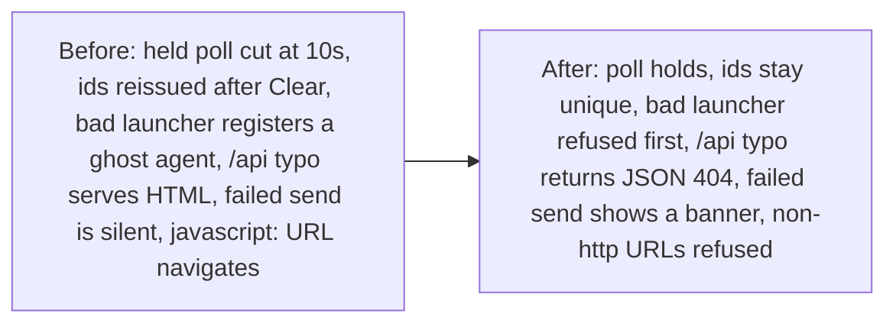

# Evidence for the design-review fixes

Test transcript: `test-transcript.txt` (every new regression test passes).

```mermaid
flowchart LR
  A[Before: held poll cut at 10s, ids reissued after Clear, bad launcher registers a ghost agent, /api typo serves HTML, failed send is silent, javascript: URL navigates] --> B[After: poll holds, ids stay unique, bad launcher refused first, /api typo returns JSON 404, failed send shows a banner, non-http URLs refused]
```
