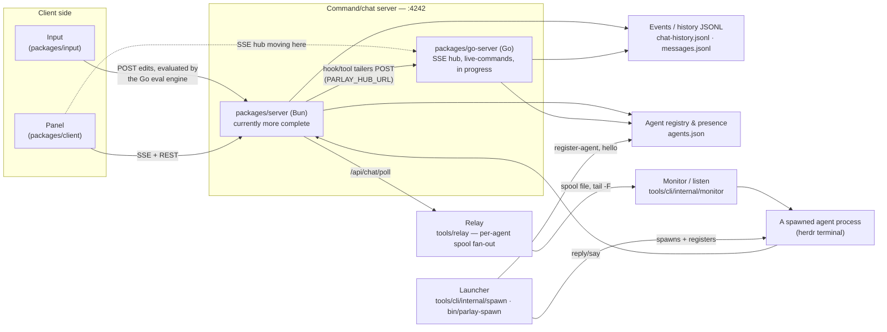

# Parlay

**Talk to your background coding agents from your phone.** Parlay gives every
long-running AI agent its own chat channel — dictate a message while you're walking
the dog, the agent picks it up, works, and replies to the same thread.

This is the project behind the **"Voice First: Code Anywhere"** demo: voice dictation
on a phone, driving autonomous terminal coding agents on a machine somewhere else.

> Status: **alpha**, single-owner. Interfaces move fast. Built for one person's
> workflow first — it works, but it has sharp edges and assumes you're comfortable
> running your own server.

---

## What you actually get

- **A per-agent chat channel.** Every enrolled agent gets its own tab. Messages route
  only to the agent they're addressed to.
- **Voice-first control.** A compiled phrase engine turns spoken commands into panel
  actions, and agent replies can be read back aloud with per-passage playback — so a
  whole review cycle can happen without a keyboard.
- **Durable identity + memory.** `identity`, `scratchpad`, and `handoff` persist
  across restarts, so an agent that blows its context window recovers *who it is* and
  *what it was doing* via the `identity → handoff → scratchpad` chain.
- **Spawn + supervise.** Launch a background agent that auto-enrols as a live tab, and
  drive event-based follow-ups.
- **Reachable from anywhere you can reach the host** — over your LAN, a
  [Tailscale](https://tailscale.com) tailnet, or just `localhost`.

## Requirements, honestly

**The CLI + server work standalone.** `bun install`, start the server, point the CLI
at it — no other services, no accounts, no tunnel. That's the path in the Quickstart
below and it is the one this repo fully supports.

**The web panel does not ship with a host.** The chat panel
(`packages/client`) is a browser bundle that expects to be served from the *same
origin* as the chat API, and the author serves it from a personal, unreleased page
host called Pulse. **Pulse is not open source and is not available** — so there is no
turnkey `open this URL and see the panel` path here yet. To run the UI you build the
bundle (`cd packages/client && bun run build`, which writes
`dist/parlay-agent.js`), serve it yourself, and reverse-proxy `/api/chat/*` to the
parlay server. That wiring is not documented here yet, and it is the main gap
between this repo and the demo.

**Tailscale is optional.** Nothing requires it. It is simply how the author reaches
the host from a phone; a LAN address or any other private tunnel works the same way.

## Quickstart (local only — no Pulse, no tailnet)

Prereqs: [Bun](https://bun.sh) and [Go](https://go.dev) 1.26+ (the CLI is Go; `bin/parlay`
builds it for you on first run).

```sh
git clone https://github.com/trillium/parlay && cd parlay
bun install                                   # also wires the git hooks (core.hooksPath tools/hooks)
```

**1. Start the server.** It listens on `:4242` and owns `/api/chat/*`:

```sh
cd packages/server && PARLAY_DATA_DIR=~/.parlay/data PAI_DIR=~/.parlay/pai-scratch bun run start
```

Both variables in that command matter, and here is why.

> **⚠️ `PARLAY_DATA_DIR` is not optional. Without it the server writes to — and can
> destroy — existing state.** Unset, it does not use one directory; it writes to two
> production locations:
>
> - **`~/exchange`** — chat history, draft, settings, agent channels, uploads.
> - **`$PAI_DIR/MEMORY/STATE`**, default **`~/.claude/PAI/MEMORY/STATE`** — the agent
>   registry (`parlay-agents.json`) and the session→channel map
>   (`parlay-session-channels.json`).
>
> That second one is the dangerous half, because a Claude Code / PAI user already has
> that directory: the server runs a prune sweep against that registry at boot, so
> starting it unconfigured mutates a live registry rather than an empty one.
> `packages/server/src/paths.ts` exists because of a real incident where exactly this
> happened and two live chat channels were deleted. `PARLAY_DATA_DIR` relocates all
> of it, flat, into the one directory you name.

`PAI_DIR` is pointed at an empty scratch directory for a second reason: it is both a
write target and a read target. Besides the registry above, the server tails that tree
for agent-activity events and re-posts every one of them over HTTP to `PARLAY_HUB_URL`
(default `http://127.0.0.1:4242`) — so on a machine that has a real `~/.claude/PAI`,
leaving `PAI_DIR` unset ships unrelated live agent turns to whatever is listening
there. Setting both variables, as the command does, is what fully protects the real
directory.

That hub is the Go server (`packages/go-server`), not this one: with only the Bun
server running, those posts hit routes it does not serve, so they are dropped with a
rate-limited warning and hook/tool activity does not appear in the panel. Tailing
itself never stops. See
[`packages/server/README.md`](packages/server/README.md) for the full config surface.

**2. Point the CLI at it**, in another shell. Every command from here on is written
relative to the **root of the clone** — step 1 left the first shell inside
`packages/server`, and a brand-new shell starts in your home directory, so `cd` to the
clone first:

```sh
cd /path/to/parlay                         # the directory you cloned into above
```

No `PARLAY_SERVER` export is needed: the CLI's coded default is
`http://localhost:4242` — exactly where step 1 put the server — and the
`bin/parlay` wrapper adds no environment of its own. If your server lives
somewhere else, either export `PARLAY_SERVER` (the environment always wins) or
run `parlay remote set <url>` (persists to `~/.parlay/config.json`, which beats
the coded default but loses to the env var).

**3. Talk to it:**

```sh
./bin/parlay                               # live snapshot: subscribers, agents, last messages
./bin/parlay send --demo --force "hello"   # message the 'demo' channel
./bin/parlay history 5                     # read it back
./bin/parlay doctor                        # self-diagnosis: server reachable? identity set?
./bin/parlay doctor --json                 # same checks as one JSON document (schema parlay.doctor/v1), for scripts/LLMs
./bin/parlay doctor deploy                 # deployment-level sweep: launchd, ports, logs, pins
```

`send` normally refuses a target that isn't in the live agent registry; `--force`
seeds a channel before its agent has registered, which is exactly the case here.

That round-trip is the whole substrate. From here:

```sh
./bin/parlay reply --agent demo "on it"           # posts an agent-role message into history; channel routing needs a spawned agent's context
./bin/parlay alert "heads up"                     # broadcast to every agent
./bin/parlay help                                 # every verb
./bin/parlay monitor --legacy-poll --agent demo   # stream a channel; runs until Ctrl-C, so give it a second shell
```

`--legacy-poll` polls natively in Go and needs nothing beyond the server. `listen` —
one-call self-enrolment: register, announce, then stream — accepts the same flag and
takes the same native path, so `listen --agent demo --name Demo --legacy-poll` gives
you a live enrolled agent on a fresh clone too.

*Without* that flag, both verbs go through a relay binary that is gitignored and that
neither `bun install` nor `bin/parlay` builds; run `tools/relay/build.sh` first or they
exit 1 with `relay is not up and could not be started`. Mind bare `listen` especially:
it registers and announces with the server *before* it starts the relay, so on a fresh
clone it leaves an agent that can never receive anything — it posts a `monitor DOWN`
notice back to the server on the way out, subject to the same spawned-context routing
caveat as `reply` above, but the registry entry survives it, so the agent stays
enrolled and deaf.

Launch a background agent that shows up as a live tab (needs a
[Claude Code](https://claude.com/claude-code) install and the
[herdr](https://github.com/trillium/herdr) terminal it spawns into):

```sh
parlay spawn code-reviewer "Code Reviewer" "#c084fc" \
  "Review the diff in ~/code/foo and report findings." --cwd ~/code/foo
```

`parlay spawn` is the sole public entry point for spawning. By default it runs the Go
launcher in-process (`tools/cli/internal/spawn`); `PARLAY_SPAWN_IMPL=bash` is a
soon-to-be-removed escape hatch that execs `bin/parlay-spawn` instead, and that script
refuses to run without a handshake env only the CLI sets (task-qyu8q scope 3). Both paths
enforce the mandatory-model gate (task-21d36).

To reach it from your phone, expose the host — Tailscale, LAN IP, or a private
tunnel — and export `PARLAY_SERVER` as that address instead of `localhost`.

**The chat API is unauthenticated by design** (that is how the CLI and plain `curl`
work — see the header of `packages/server/src/guard.ts`), so anything that can reach
the port can post into a live agent's turn. Expose it only over a private network —
a tailnet, a VPN, or a LAN you control — never a public tunnel or a port forwarded
to the internet.

## Layout

A [Bun](https://bun.sh) workspace monorepo, plus several standalone Go modules.
This table is a newcomer's map of the parts you need first, not a complete index
of every module in the repo:

| Package | What it is |
|---|---|
| `packages/server` | The Bun server that owns `/api/chat/*`: chat history, SSE, the long-poll feed the relay consumes, the server-side-eval relay, upload/link handling. Runs standalone on `:4242`. |
| `tools/relay` | The standalone per-agent relay daemon — its own Go module, built by `tools/relay/build.sh`. Fans the server's `/api/chat/poll` feed out to enrolled agents; `parlay monitor`/`listen` need it unless you pass `--legacy-poll`. |
| `packages/go-server` | An in-progress Go rewrite of the same HTTP/SSE surface. See [`docs/api-contract.md`](docs/api-contract.md). |
| `packages/client` | The chat panel — tabs, presence, message rendering, TTS/speech playback, annotations. Built as a browser bundle; needs a host that serves it same-origin with the API. |
| `tools/cli` | The Go `parlay` command surface — `reply`/`say`, `monitor`, `identity`/`scratchpad`/`handoff`, `alert`, `doctor`/`health`, `shutdown`, and more. Also embeds the compiled Go (RE2) eval-engine — the voice layer that matches spoken/typed phrases to a closed set of panel actions — as `parlay eval serve` (`internal/evalengine`). `bin/parlay` builds and execs this binary. |
| `packages/input` | `parlay-input` — a self-contained, framework-agnostic DOM input wrapper for wiring your own UI input to a parlay server. The one publishable npm package; no dependencies. |

Agent-facing entry points live in `bin/` (`parlay`, `parlay-spawn`, …).

## System map

Every load-bearing part of parlay, verified against the current code (2026-09-03), with
a link to a deeper-dive doc. This is not a diagram of an idealized architecture — it
shows a real, in-transition system, including the parts that are only half-wired today
(see [`command-server.md`](docs/command-server.md) and [`monitor.md`](docs/monitor.md)
for the specifics).



| Part | What it does | Deep dive |
|---|---|---|
| **Input** | DOM wrapper that turns edits in a composer element into evaluated phrase-engine actions. | [`docs/input.md`](docs/input.md) |
| **Command/chat server** | Owns `/api/chat/*` — two implementations coexist today (Bun is more complete; Go owns the newer SSE hub and live-command registry), with a real gap between them. | [`docs/command-server.md`](docs/command-server.md) |
| **Events / history (JSONL)** | Append-only chat history, plus the hook/tool-activity tailers that feed it — two different files depending on which server wrote them. | [`docs/events-history.md`](docs/events-history.md) |
| **Agent registry & presence** | Who is enrolled as a chat tab, and transient (in-memory-only) connection counts. | [`docs/agent-registry.md`](docs/agent-registry.md) |
| **Monitor / listen** | How an enrolled agent actually receives messages — relay-backed by default, `--legacy-poll` as a no-relay fallback with a documented dead-tab gap. | [`docs/monitor.md`](docs/monitor.md) |
| **Launcher (spawn)** | Launches a new background agent into a live chat tab — two implementations, one of which lacks the other's safety gates. | [`docs/launcher.md`](docs/launcher.md) |
| **Relay** | Single fan-out daemon between the server's long-poll feed and every enrolled agent's monitor; a per-runtime-dir singleton, not built by default. | [`docs/relay.md`](docs/relay.md) |
| **Live-command registry** | A separate registry from agent enrollment — tracks running `parlay` CLI invocations for `parlay commands` and the panel's live-commands view. | [`docs/live-commands.md`](docs/live-commands.md) |
| **CLI** | The `parlay` Go command surface and the embedded voice/phrase eval engine. | [`tools/cli`](tools/cli), [`docs/CLI_VERBS_AND_EVENTS.md`](docs/CLI_VERBS_AND_EVENTS.md) |
| **Panel** | The browser chat UI — tabs, presence, TTS, annotations. Not shipped with a host; see the Requirements section above. | [`packages/client`](packages/client) |

## A worked config

[`examples/`](examples/) is a complete two-agent setup — every file a configured
parlay actually needs, with notes on what to change. `examples/bootstrap-sandbox.sh`
instantiates it in a throwaway sandbox and exercises it, leaving your own files and
your running server alone — read its limits in [`examples/`](examples/) before you run it.

## Development

```sh
cd packages/<name> && bun test    # a TS package (server/client/input), from inside it — see note below
cd tools/cli && go test ./...     # the Go CLI
```

There is no root `bunfig.toml`, so `bun test` at the repo root does not load the
happy-dom preload some packages need: DOM-touching suites fail there with
`ReferenceError: document is not defined` even though they pass in-package —
always run a suite from inside its own package. CI
(`.github/workflows/ci.yml`) runs on every pull request and on pushes to
`main`, and does exactly that for the Go modules, the Bun packages, and the
hermetic shell harnesses.

Repo conventions worth knowing:

- **`bun install` installs this repo's git hooks.** The root `package.json`
  `prepare` script runs `git config core.hooksPath tools/hooks`. `pre-commit`
  runs for everyone: it enforces the 250-line limit below and auto-bumps
  `PA_VERSION`. `post-commit`/`post-merge` rebuild and deliver the panel bundle
  — a build plus a POST to a local Pulse server — and **do nothing at all unless
  you opt in**:

  ```sh
  git config --bool parlay.autobuild true   # enable; omit or set false to stay off
  ```

  That setting lands in the clone's shared `.git/config`, so **one `git config`
  covers every linked worktree of that clone** — it does not matter which
  checkout you run it from, and you never run it per worktree. Opted out, the
  skip is not silent: on a commit that would otherwise have delivered, the hook
  prints one line saying delivery was skipped and one giving the command above.

  Enabling is not delivering — two different things. Opted in, the hooks still
  deliver only from the repo's primary checkout; a commit in a linked worktree
  logs a skip and delivers nothing. Set `PARLAY_MAIN_CHECKOUT` to point them at
  a different tree. To drop all the hooks including `pre-commit`:
  `git config --unset core.hooksPath` — but note that escape hatch is not
  durable, because the `prepare` script above re-runs `git config
  core.hooksPath tools/hooks` on the next `bun install` and silently puts them
  back.
- **250-line file limit** (pre-commit) — split a module into a subfolder + barrel
  index past the limit.
- **Two version axes** — the repo release `vX.Y.Z` git tag and the panel build
  `PA_VERSION` (`packages/client/src/version.ts`, auto-bumped per client change).
- **Build the panel bundle with `cd packages/client && bun run build`** (that runs
  `build.ts`, which writes `dist/parlay-agent.js`). On success it also POSTs a
  best-effort reload beacon to `$PARLAY_RELOAD_TARGET` (default `127.0.0.1:4242`);
  if nothing is listening there it just logs that and moves on. If you *are*
  running a live server on that port, the build will force-reload its connected
  clients — use `bun test` or a scoped `bun build src/<file>.ts --outdir=<tmp>`
  when you only want to validate a change.

Docs of note: [`docs/api-contract.md`](docs/api-contract.md) (the HTTP contract
between client, CLI, and server), [`docs/COMMAND_DESIGN_CONTRACT.md`](docs/COMMAND_DESIGN_CONTRACT.md)
(the voice engine), and [`docs/CLI_VERBS_AND_EVENTS.md`](docs/CLI_VERBS_AND_EVENTS.md)
(CLI verb authoring — sound mechanics, but written against the retired TS CLI;
`tools/cli` is the live surface). Several docs in `docs/` describe integration with the author's
own agent fleet, some of it public and some not — [`docs/README.md`](docs/README.md)
says which is which.

## Contributing

This is an alpha, single-owner project moving fast, so there's no formal contribution
process yet. Issues and PRs are welcome, but expect interfaces to shift under you.

## License

[MIT](LICENSE) © Trillium Smith
