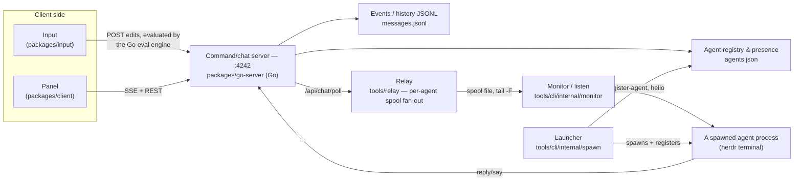

# Parlay

**Talk to your background coding agents from your phone.** Parlay gives every
long-running AI agent its own chat channel — dictate a message while you're walking
the dog, the agent picks it up, works, and replies to the same thread.

This is the project behind the **"Voice First: Code Anywhere"** demo: voice dictation
on a phone, driving autonomous terminal coding agents on a machine somewhere else.

> Status: **alpha**, single-owner. Interfaces move fast. Built for one person's
> workflow first — it works, but it has sharp edges and assumes you're comfortable
> running your own server.

---

## What you actually get

- **A per-agent chat channel.** Every enrolled agent gets its own tab. Messages route
  only to the agent they're addressed to.
- **Voice-first control.** A compiled phrase engine turns spoken commands into panel
  actions, and agent replies can be read back aloud with per-passage playback — so a
  whole review cycle can happen without a keyboard.
- **Durable identity + memory.** `identity` and `scratchpad` persist across
  restarts, so an agent that blows its context window recovers *who it is* and
  *what it was doing*. Both are plain files under `~/.parlay/agents/<id>/` and work
  standalone on any clone. (The full `identity → handoff → scratchpad` chain adds a
  `handoff` leg from the author's private beads-store tooling — `handoff` is not a
  `parlay` verb and is not installed by this repo, so a clone gets the portable two
  legs. See the note below.)
- **Spawn + supervise.** Launch a background agent that auto-enrols as a live tab, and
  drive event-based follow-ups.
- **Reachable from anywhere you can reach the host** — over your LAN, a
  [Tailscale](https://tailscale.com) tailnet, or just `localhost`.

## Requirements, honestly

**The CLI + server work standalone.** Start the server, point the CLI
at it — no other services, no accounts, no tunnel. That's the path in the Quickstart
below and it is the one this repo fully supports. ([Bun](https://bun.sh) is only
needed if you also want the chat panel or the git hooks.)

**The chat panel needs Bun and nothing else.** `packages/client` is a browser
bundle, and the Go server *is* its host: it serves the bundle same-origin from the
same `:4242` it serves `/api/chat/*` on, so there is no reverse proxy to wire and
no second service to run. Build the bundle (`cd packages/client && bun run build`)
and open `http://localhost:4242/` — Quickstart step 4. The author's own install
hosts the panel behind a private page host called Pulse, which is **not open
source and not available here**, but nothing in this repo requires it; it is a
distribution choice, not a dependency. A second, separate bundle — the fleet
dashboard (`packages/webview`) — is served at `/fleet/` and is not part of the
Quickstart.

**Tailscale is optional.** Nothing requires it. It is simply how the author reaches
the host from a phone; a LAN address or any other private tunnel works the same way.

## Quickstart (local only — no Pulse, no tailnet)

Prereqs: [Go](https://go.dev) **1.26.5+** — the CLI and server are both Go, and
`bin/parlay` builds the CLI for you on first run. (1.26.5, not 1.26, because
`tools/cli/go.mod` declares `go 1.26.5`; with the default `GOTOOLCHAIN=auto`
Go downloads the newer toolchain for you, but with `GOTOOLCHAIN=local` it is a
hard error.)

[Bun](https://bun.sh) is needed **only** if you want the chat panel
(`packages/client`) or the git hooks. Every command in this Quickstart is Go, so
you can skip `bun install` entirely.

> **This repo is four separate Go modules** — `packages/go-server`, `tools/cli`,
> `tools/relay`, `packages/spawn-profiles` — and there is **no root `go.work`**.
> So every `go` command has to be run from *inside* the module it names. A
> repo-root-relative path such as `go run ./packages/go-server/cmd/parlay-server`
> fails with `go.mod file not found in current directory or any parent directory`.
> Each step below says which directory it runs in; every command from here on is
> relative to the root of the clone unless it says otherwise.

```sh
git clone https://github.com/trillium/parlay && cd parlay
bun install                                   # optional: also wires the git hooks (core.hooksPath tools/hooks)
```

**1. Start the server.** It's `packages/go-server`, a single Go binary that listens on
`:4242` (default `PARLAY_SERVER_ADDR=127.0.0.1:4242`) and owns `/api/chat/*`:

```sh
cd packages/go-server && go run ./cmd/parlay-server
```

It persists state under `$PARLAY_STATE_HOME` (default `~/.parlay`) — messages/agents/
drafts/settings/uploads live there. To keep a dev run fully isolated from live state:

```sh
cd packages/go-server && go run ./cmd/parlay-server -state-dir ~/.parlay/dev-data
```

> **⚠️ The server reads and writes its persisted store from `~/.parlay` by default.**
> If you're running it alongside a live install, point `-state-dir` (or
> `PARLAY_STATE_HOME`) at a scratch directory so you don't collide with or clobber
> existing state. The chat history, agent registry, drafts, settings and uploads all
> live there.

**2. Point the CLI at it**, in another shell. Every command from here on is written
relative to the **root of the clone**:

```sh
cd /path/to/parlay                         # the directory you cloned into above
```

No `PARLAY_SERVER` export is needed: the CLI's coded default is
`http://localhost:4242` — exactly where step 1 put the server — and the
`bin/parlay` wrapper adds no environment of its own. If your server lives
somewhere else, either export `PARLAY_SERVER` (the environment always wins) or
run `parlay remote set <url>` (persists to `~/.parlay/config.json`, which beats
the coded default but loses to the env var).

**3. Talk to it:**

```sh
./bin/parlay                               # live snapshot: subscribers, agents, last messages
./bin/parlay send --demo --force "hello"   # message the 'demo' channel
./bin/parlay history 5                     # read it back
./bin/parlay health                        # host vitals: is the server up, how much memory (see note below)
./bin/parlay doctor                        # self-diagnosis: server reachable? identity set?
./bin/parlay doctor --json                 # same checks as one JSON document (schema parlay.doctor/v1), for scripts/LLMs
./bin/parlay doctor deploy                 # deployment-level sweep: launchd, ports, logs, pins
```

`doctor deploy` is for a machine running the launchd services
(`packages/go-server/deploy/install.sh`); on a fresh clone it has nothing to
inventory and says so. Its health probes follow the same server/engine
resolution as every other verb, so it reports on the server your CLI is
actually pointed at — never on a hardcoded `:4242`.

`send` normally refuses a target that isn't in the live agent registry; `--force`
seeds a channel before its agent has registered, which is exactly the case here.

`doctor` is an **agent's** self-check, so run from a plain host shell it reports
`FAIL PARLAY_AGENT_ID is not set` and exits 1 — by design, not a broken install.
That is the one check the Quickstart's shell cannot satisfy; `health` is the
host-level equivalent. Run `doctor` inside a spawned agent to see the rest
(registry enrolment, monitor, identity, scratchpad, spawn credentials).

`health` reports the chat **server** (labelled `server`, not `relay` — parlay
ships a separate relay daemon that only `parlay monitor` needs) and then the
optional **voice engine**. You have not installed a voice engine at this point,
so that line is red and `health` exits 1; that is the engine, not your install.
Start one with `nohup ./bin/parlay eval serve &` only if you want spoken or typed
phrase commands — the CLI, the API and the panel's text chat do not need it.

The engine is the one component with no per-instance identity: it has no state
directory and no `config.json` key, so its *address* is its identity, and
`127.0.0.1:4343` is a host-wide slot shared by every parlay instance on the
machine. That is fine for the single-instance Quickstart above. If you run a
second instance — `parlay-dev`, a `-state-dir` server, or `parlay remote set` —
the engine needs two knobs moved together, because it both *answers* probes and
*pushes* actions:

- `PARLAY_EVAL_ENGINE_URL` — where `parlay health` / `parlay doctor` probe it.
  Leave it at the default with a non-default server and those two annotate the
  line as the host's engine rather than let a green tick describe another
  instance's.
- `parlay eval serve --push-url` (or `PARLAY_EVAL_PUSH_URL`) — where the engine
  delivers computed panel actions. Its default is the **default** server's
  `http://127.0.0.1:4242/api/chat/eval-push`, so an engine started for a second
  instance without this would drive the *first* instance's panel.

There is a third, quieter cross-instance coupling, in the CLI rather than the
engine: **`parlay listen --agent <id>` is a host-wide takeover.** It finds any
other live `listen`/`monitor` on the same agent *id* in this host's process
table and ends it — it does not distinguish instances, servers or state dirs. So
a second instance's `listen --agent demo` kills the first instance's `demo`
listener and leaves that instance registered but deaf. Give each instance its own
agent ids (`demo` vs `demo-dev`); `--name`/`--color` do not scope it. If you
deliberately want two instances sharing one channel name, set
`PARLAY_LISTEN_NO_SINGLETON=1` in the one that must not evict (duplicate delivery
becomes possible, and the skip is announced on stderr). `parlay shutdown <id>`
reaps by the same id-based match, so it reaches across instances too. Only a process
whose own `argv[0]` is `parlay` or `parlay-cli` is ever a candidate, so a script,
shell or agent harness that merely *contains* that command line is never the victim
— arming from a wrapper cannot kill the wrapper (this repo's guard got that wrong
until 2026-10-05). The flip side is that a renamed copy of the binary is not
detected at all, so duplicate delivery comes back silently.

And a fourth, in the relay itself: **the relay is a per-user singleton that binds
one upstream server for life.** `tools/relay` runs one process per user on the
host-wide `$TMPDIR/parlay` runtime dir, started with a single `-server`. A second
instance shares that process, so `listen`/`monitor` without `--legacy-poll` would
enroll into a relay that is polling the *other* instance's chat server — the
enroll succeeds, the tab looks live, and nothing you send to your own server ever
arrives. `parlay monitor`/`listen` now refuse this before registering anything:
`preflight OK` means the relay is up **and** polling the server your CLI is
pointed at, and a mismatch exits 1 naming both (a relay too old to report which
server it polls is let through — the check cannot guess). Three ways out — use
`--legacy-poll`, give the instance its own relay (a `PARLAY_RELAY_RUNTIME=<dir>`
plus a relay started with `-server $PARLAY_SERVER`), or point `PARLAY_SERVER` at
whatever the existing relay is already polling.

**4. Open the panel (optional — this is the only step that needs Bun):**

```sh
cd packages/client && bun run build      # writes dist/index.html + dist/parlay-agent.js
```

Then open <http://localhost:4242/>. The server found the bundle by itself: it
resolves `packages/client/dist` from its own install location first and from the
directory you started it in second, so the command in step 1 works unchanged. If
your bundle lives somewhere else, pass `-assets-dir <path>` or export
`PARLAY_ASSETS_DIR`.

Until you build it, `GET /` answers `503` with those instructions on its body —
every `/api/chat/*` route works regardless, and none of the CLI in step 3 ever
needed the panel. The bundle is gitignored, so this is a once-per-clone build.

`/fleet/` is a *different* app (`packages/webview`, React) served from
`<assets-dir>/fleet`; `packages/go-server/deploy/install.sh --build` builds and
copies it there. It is not needed for anything above.

That round-trip is the whole substrate. From here:

```sh
./bin/parlay reply --agent demo "on it"           # posts an agent-role message into history; channel routing needs a spawned agent's context
./bin/parlay alert "heads up"                     # broadcast to every agent
./bin/parlay help                                 # every verb
./bin/parlay <verb> --help                        # one verb, in detail (every verb answers this)
./bin/parlay monitor --legacy-poll --agent demo   # stream a channel; runs until Ctrl-C, so give it a second shell
```

`--legacy-poll` polls natively in Go and needs nothing beyond the server. `listen` —
one-call self-enrolment: register, announce, then stream — accepts the same flag and
takes the same native path, so `listen --agent demo --name Demo --legacy-poll` gives
you a live enrolled agent on a fresh clone too.

*Without* that flag, both verbs go through a relay binary that is gitignored and that
neither `bun install` nor `bin/parlay` builds; run `tools/relay/build.sh` first or they
exit 1 with `relay is not up and could not be started`. That is a clean failure, not a
trap: every enrolling entry point — `listen`, `monitor`, and `claim` — preflights the
relay *before* it registers, so a failed preflight exits with **nothing enrolled**
(`NOT registered, so nothing is deaf`) rather than leaving a tab that looks live in the
panel and can never receive anything.

Launch a background agent that shows up as a live tab (needs a
[Claude Code](https://claude.com/claude-code) install and the
[herdr](https://github.com/trillium/herdr) terminal it spawns into):

```sh
parlay spawn code-reviewer "Code Reviewer" "#c084fc" \
  "Review the diff in ~/code/foo and report findings." --cwd ~/code/foo --model sonnet
```

**`--model` is mandatory and there is no default.** Omit it and `parlay spawn` refuses
with exit 2 and *`refusing to spawn — no model was chosen`*: the launching session's
model is never inherited and there is no silent sonnet fallback. Three things satisfy
the gate — `--model <id>` (what the example does), a `--profile <name>` that carries a
model ([`packages/spawn-profiles`](packages/spawn-profiles)), or `--no-pii`, which
auto-routes to a free model. `parlay spawn --list` renders the profile catalog.

One thing to know before your first spawn: for the default `claude` harness the
launcher starts it with `--dangerously-skip-permissions` (plus a `--strict-mcp-config`
and a sonnet fallback), deliberately — a phone-driven agent cannot answer a permission
prompt. Every other harness gets only its explicit `--model` and uses its own
permission config. Details in [`docs/launcher.md`](docs/launcher.md).

`parlay spawn` is the sole entry point for spawning, and the only one there is: the
launcher runs in-process (`tools/cli/internal/spawn`). The bash spawner and its
`PARLAY_SPAWN_IMPL=bash` escape hatch are gone (task-42qot), so the mandatory-model gate
(task-21d36) cannot be routed around.

To reach it from your phone, expose the host — Tailscale, LAN IP, or a private
tunnel — and export `PARLAY_SERVER` as that address instead of `localhost`.

> **One honest caveat about context recovery.** A spawned agent that exhausts its
> context is supposed to recover through an `identity → handoff → scratchpad` chain.
> Two of those three legs are yours: `parlay identity` and `parlay scratchpad` are
> plain files under `~/.parlay/agents/<id>/` and work on any clone. The middle leg,
> `handoff`, is **not a `parlay` verb** — it is a beads-store wrapper from the
> author's own federation tooling (the same family as `task`/`inbox`), and this repo
> neither ships nor installs it. So the flags that lean on it —
> `identity --submit`, `--park`, `--complete`, and `parlay drawdown`'s closing
> recipe — either need an id passed explicitly (`parlay identity --submit <handoff-id>`,
> which works with no store installed) or are simply skipped. Every command involved
> detects this and says so rather than pointing you at a command you do not have.

**The chat API is unauthenticated by design** (that is how the CLI and plain `curl`
work — see the origin guard in `packages/go-server/internal/guard`), so anything
that can reach the port can post into a live agent's turn. Expose it only over a
private network — a tailnet, a VPN, or a LAN you control — never a public tunnel or
a port forwarded to the internet.

## Fleet layer and `parlay-dev`

The core product (`packages/*`, `tools/cli`, `bin/parlay`, the server) installs and
runs as above. Separate from that is a **fleet layer** — the inbox tooling, the
pi-inbox bridge, and the agent skills that the author's personal fleet runs. It is
personal glue, deliberately kept out of `tools/` and `skills/` of the core repo; it
lives instead under `examples/fleet/`.

**Install the fleet layer** with one command (idempotent, reversible):

```sh
examples/fleet/install.sh             # install everything (or --status / --uninstall)
```

What it wires up:

| Thing | Home | How |
|---|---|---|
| `inbox`, `inbox-dispatch` | `~/.local/bin/` | backup-then-copy via each tool's own `install.sh` |
| pi-inbox bridge | `~/.pi/agent/extensions/parlay-pi-inbox/` | copied dir (so `./src` imports resolve) |
| fleet skills (`inbox-handler`, `parlay-spawn`, `voice-command-consulting`) | `~/.claude/skills/<name>` | symlink to `examples/fleet/skills/<name>` (edits apply immediately) |

**`parlay` vs `parlay-dev`** — one wrapper script (`bin/parlay`), two names:

- `parlay` — production/fleet mode. State in `~/.parlay`, talks to the running server.
- `parlay-dev` — development mode. Same checkout, but `PARLAY_STATE_HOME` is redirected
  to `~/.parlay-dev` so building/testing `main` never touches live fleet state
  (`config.json`, identity, scratchpads, spawn defaults).

Both are symlinks to `bin/parlay`; the invoked basename selects. `parlay-dev` isolates
**client-side** state only — it still reaches the same server (`:4242` by default). For
a fully isolated dev environment, also point `PARLAY_SERVER` at a scratch server, since
agent registration is server-side.

**Fresh-checkout note:** `bin/parlay-dev` is a tracked symlink in the repo, so any
checkout has it automatically; `~/.local/bin/parlay` and `~/.local/bin/parlay-dev` on
a live host are created by the install step (see the wrapper header / install docs).

## Layout

A [Bun](https://bun.sh) workspace monorepo for the client packages, plus standalone
Go modules for the server and CLI. This table is a newcomer's map of the parts you
need first, not a complete index of every module in the repo:

| Package | What it is |
|---|---|
| `packages/go-server` | The Go server that owns `/api/chat/*`: chat history, SSE, the long-poll feed the relay consumes, the server-side-eval relay, upload/link handling, drafts/settings. Runs standalone on `:4242` (`cd packages/go-server && go run ./cmd/parlay-server`). The contract it implements lives in [`docs/api-contract.md`](docs/api-contract.md). |
| `tools/relay` | The standalone per-agent relay daemon — its own Go module, built by `tools/relay/build.sh`. Fans the server's `/api/chat/poll` feed out to enrolled agents; `parlay monitor`/`listen` need it unless you pass `--legacy-poll`. |
| `packages/client` | The chat panel — tabs, presence, message rendering, TTS/speech playback, annotations. Built as a browser bundle with `cd packages/client && bun run build`; the Go server serves it same-origin from `-assets-dir` (`packages/client/dist`), so it needs no separate host or proxy. |
| `tools/cli` | The Go `parlay` command surface — `reply`/`say`, `monitor`, `identity`/`scratchpad`, `alert`, `doctor`/`health`, `shutdown`, and more. Also embeds the compiled Go (RE2) eval-engine — the voice layer that matches spoken/typed phrases to a closed set of panel actions — as `parlay eval serve` (`internal/evalengine`). `bin/parlay` builds and execs this binary. |
| `packages/input` | `parlay-input` — a self-contained, framework-agnostic DOM input wrapper for wiring your own UI input to a parlay server. The one publishable npm package; no dependencies. |
| `examples/fleet` | The author's personal **fleet layer** — inbox dispatcher/emit, pi-inbox bridge, and the agent skills. Not core product; installs via `examples/fleet/install.sh`. |

Agent-facing entry points live in `bin/` (`parlay`, `parlay-treehouse-guard`, …).

## System map

Every load-bearing part of parlay, verified against the current code (2026-09-03), with
a link to a deeper-dive doc. This is not a diagram of an idealized architecture — it
shows a real, in-transition system, including the parts that are only half-wired today
(see [`command-server.md`](docs/command-server.md) and [`monitor.md`](docs/monitor.md)
for the specifics).


```mermaid
flowchart LR
    subgraph client_side["Client side"]
        input["Input\n(packages/input)"]
        panel["Panel\n(packages/client)"]
    end

    server["Command/chat server — :4242\npackages/go-server (Go)"]

    hist["Events / history JSONL\nmessages.jsonl"]
    registry["Agent registry & presence\nagents.json"]
    relay["Relay\ntools/relay — per-agent spool fan-out"]
    monitor["Monitor / listen\ntools/cli/internal/monitor"]
    launcher["Launcher\ntools/cli/internal/spawn"]
    agent["A spawned agent process\n(herdr terminal)"]

    input -- "POST edits, evaluated by\nthe Go eval engine" --> server
    panel -- "SSE + REST" --> server
    server --> hist
    server --> registry
    server -- "/api/chat/poll" --> relay
    relay -- "spool file, tail -F" --> monitor
    monitor --> agent
    launcher -- "spawns + registers" --> agent
    launcher -- "register-agent, hello" --> registry
    agent -- "reply/say" --> server
```

| Part | What it does | Deep dive |
|---|---|---|
| **Input** | DOM wrapper that turns edits in a composer element into evaluated phrase-engine actions. | [`docs/input.md`](docs/input.md) |
| **Command/chat server** | Owns `/api/chat/*` — a single Go implementation (`packages/go-server`), the sole server; the TS server it replaced was deleted with the Bun→Go cutover. | [`docs/command-server.md`](docs/command-server.md) |
| **Events / history (JSONL)** | The one append-only chat-history file in the server's state dir (`messages.jsonl`), and the out-of-process hook/tool producers that post into it over HTTP. | [`docs/events-history.md`](docs/events-history.md) |
| **Agent registry & presence** | Who is enrolled as a chat tab, and transient (in-memory-only) connection counts. | [`docs/agent-registry.md`](docs/agent-registry.md) |
| **Monitor / listen** | How an enrolled agent actually receives messages — relay-backed by default, `--legacy-poll` as a no-relay fallback with a documented dead-tab gap. | [`docs/monitor.md`](docs/monitor.md) |
| **Launcher (spawn)** | Launches a new background agent into a live chat tab — one in-process implementation (`tools/cli/internal/spawn`), so the model and beads gates cannot be routed around. | [`docs/launcher.md`](docs/launcher.md) |
| **Relay** | Single fan-out daemon between the server's long-poll feed and every enrolled agent's monitor; a per-runtime-dir singleton, not built by default. | [`docs/relay.md`](docs/relay.md) |
| **Live-command registry** | A separate registry from agent enrollment — tracks running `parlay` CLI invocations for `parlay commands` and the panel's live-commands view. | [`docs/live-commands.md`](docs/live-commands.md) |
| **CLI** | The `parlay` Go command surface and the embedded voice/phrase eval engine. | [`tools/cli`](tools/cli) — start with `parlay help`, then `parlay <verb> --help`. The authoring doc ([`docs/CLI_VERBS_AND_EVENTS.md`](docs/CLI_VERBS_AND_EVENTS.md)) is TS-era design, not the live surface. |
| **Panel** | The browser chat UI — tabs, presence, TTS, annotations. A gitignored bundle (`packages/client/dist`) that the Go server serves same-origin from `-assets-dir`, so it is the server's own host rather than a separate one. | [`packages/client`](packages/client) |

## A worked config

[`examples/`](examples/) is a complete two-agent setup — every file a configured
parlay actually needs, with notes on what to change. `examples/bootstrap-sandbox.sh`
instantiates it in a throwaway sandbox and exercises it, leaving your own files and
your running server alone — read its limits in [`examples/`](examples/) before you run it.

## Development

```sh
cd packages/go-server && go test ./...     # the Go server
cd packages/client && bun test             # a TS client package, from inside it — see note below
cd tools/cli && CGO_ENABLED=0 go test ./...  # the Go CLI — see the cgo note below
```

The `CGO_ENABLED=0` on the CLI line is required, not decoration.
`tools/cli`'s beads dependency carries an embedded Dolt tree whose ICU binding
needs C++ headers that a stock macOS toolchain does not ship, so the same
command with cgo on fails to build with
`fatal error: 'unicode/regex.h' file not found` — for `go test`, for
`go build`, and for the plain `go build .` that `bin/parlay` runs (which is why
the wrapper pins the flag itself). Nothing in the CLI needs cgo. On Linux, or
with a full Xcode/ICU toolchain installed, the flag is harmless either way.
Every committed `deploy/install.sh` carries it for the same reason, and
`tools/cli/deploy_build_flags_gate_test.go` fails the build if one regresses.

There is no root `bunfig.toml`, so `bun test` at the repo root does not load the
happy-dom preload some client packages need: DOM-touching suites fail there with
`ReferenceError: document is not defined` even though they pass in-package —
always run a suite from inside its own package. CI
(`.github/workflows/ci.yml`) runs on every pull request and on pushes to
`main`, and does exactly that for the Go modules, the Bun client packages, and
the hermetic shell harnesses.

Repo conventions worth knowing:

- **`bun install` installs this repo's git hooks.** The root `package.json`
  `prepare` script runs `git config core.hooksPath tools/hooks`. `pre-commit`
  runs for everyone: it enforces the 250-line limit below and auto-bumps
  `PA_VERSION`. `post-commit`/`post-merge` rebuild and deliver the panel bundle
  — a build plus a POST to the local server — and **do nothing at all unless
  you opt in**:

  ```sh
  git config --bool parlay.autobuild true   # enable; omit or set false to stay off
  ```

  That setting lands in the clone's shared `.git/config`, so **one `git config`
  covers every linked worktree of that clone** — it does not matter which
  checkout you run it from, and you never run it per worktree. Opted out, the
  skip is not silent: on a commit that would otherwise have delivered, the hook
  prints one line saying delivery was skipped and one giving the command above.

  Enabling is not delivering — two different things. Opted in, the hooks still
  deliver only from the repo's primary checkout; a commit in a linked worktree
  logs a skip and delivers nothing. Set `PARLAY_MAIN_CHECKOUT` to point them at
  a different tree. To drop all the hooks including `pre-commit`:
  `git config --unset core.hooksPath` — but note that escape hatch is not
  durable, because the `prepare` script above re-runs `git config
  core.hooksPath tools/hooks` on the next `bun install` and silently puts them
  back.
- **250-line file limit** (pre-commit) — split a module into a subfolder + barrel
  index past the limit.
- **Two version axes** — the repo release `vX.Y.Z` git tag and the panel build
  `PA_VERSION` (`packages/client/src/version.ts`, auto-bumped per client change).
- **Build the panel bundle with `cd packages/client && bun run build`** (that runs
  `build.ts`, which writes `dist/parlay-agent.js`). On success it also POSTs a
  best-effort reload beacon to `$PARLAY_RELOAD_TARGET` (default `127.0.0.1:4242`);
  if nothing is listening there it just logs that and moves on. If you *are*
  running a live server on that port, the build will force-reload its connected
  clients — use `bun test` or a scoped `bun build src/<file>.ts --outdir=<tmp>`
  when you only want to validate a change.

Docs of note: [`docs/api-contract.md`](docs/api-contract.md) (the HTTP contract
between client, CLI, and server), [`docs/COMMAND_DESIGN_CONTRACT.md`](docs/COMMAND_DESIGN_CONTRACT.md)
(the voice engine), and [`docs/CLI_VERBS_AND_EVENTS.md`](docs/CLI_VERBS_AND_EVENTS.md)
(CLI verb authoring — sound mechanics, but written against the retired TS CLI;
`tools/cli` is the live surface). Several docs in `docs/` describe integration with the author's
own agent fleet, some of it public and some not — [`docs/README.md`](docs/README.md)
says which is which.

## Publishing

**The `parlay` package name on npm is taken by an unrelated third party**, so no package in
this repo can be published under the bare name. That single fact drives every naming decision
here, and it is not a style preference:

- **Publishable packages use flat, unscoped `parlay-<part>` names** — `parlay-input`, and any
  future `parlay-<part>`. Only `packages/input` is public today.
- **The `@parlay` scope is never published.** It has no packages under it, and adding some
  would mean claiming a scope this project does not own. If you are tempted to "fix" a
  package name by moving it under `@parlay/…`, don't — that is the one direction that is
  closed.

If you hit an install that resolves to something unexpected, check the version you actually
got. `parlay-input` on the npm registry is a **0.1.0 alias stub** that points at the
unpublished `@parlay/input`; the real implementation here is **0.2.0** and has not been
published. Consumers who need the working package today vendor `dist/` from this repo — see
`packages/input/README.md`.

## Contributing

This is an alpha, single-owner project moving fast, so there's no formal contribution
process yet. Issues and PRs are welcome, but expect interfaces to shift under you.

## License

[MIT](LICENSE) © Trillium Smith
