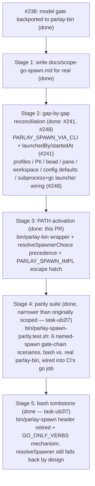

# Go spawn reconciliation scope

> **HISTORICAL — this document describes a system that no longer exists.**
> Read it as the record of what the `bin/parlay-spawn` → Go reconciliation had
> to close, not as a map of the code. As of task-42qot (PR
> [#270](https://github.com/trillium/parlay/pull/270) + its follow-up) there is
> exactly ONE spawner: `tools/cli/internal/spawn`, run in-process by `parlay
> spawn`. `tools/parlay-bin`, `bin/parlay-spawn`, `resolveSpawner()`,
> `PARLAY_SPAWN_IMPL`/`spawnImpl` and the `PARLAY_SPAWN_VIA_CLI` handshake are
> all deleted.
>
> **For current behavior read [`docs/launcher.md`](launcher.md) and
> [`docs/agent-notes/go-spawner-folded-into-tools-cli.md`](agent-notes/go-spawner-folded-into-tools-cli.md).**
>
> Three reading rules for everything below:
> 1. Every `tools/parlay-bin/<file>.go` path is `tools/cli/internal/spawn/<file>.go`.
> 2. Every `bin/parlay-spawn:<line>` citation points into a deleted file —
>    `git show 046919aa:bin/parlay-spawn` to read it.
> 3. Anything in §2 marked **Partial**, **Missing** or **Divergent** may since
>    have been closed. §0's changelog records the ones that were.

**Status:** historical record of the `tools/parlay-bin` ↔ `bin/parlay-spawn`
reconciliation (task-04g1, [discussion #237](https://github.com/trillium/parlay/discussions/237)).
**Written:** 2026-09-03. **Superseded:** 2026-09-05 (task-42qot).

Every claim in §1–§6 was verified against the tree as it stood on 2026-09-03
(`bin/parlay-spawn` at 1859 lines, `tools/parlay-bin/spawn.go` at 366 lines).
That verification is what makes §1 worth keeping: it is the only surviving
inventory of what the bash spawner actually did.

---

## 0. Addendum (2026-09-04) — task-42qot supersedes the Stage 5 end-state

**Read this before §7.** The staged plan below ends at a Stage 5 "bash tombstone"
in which `bin/parlay-spawn` stays the installed spawner and `resolveSpawner()`
keeps falling back to it by design. **task-42qot replaces that end-state.** The
reconciliation no longer ends with two implementations resolving against each
other on `PATH`; it ends with one:

- `tools/parlay-bin` is **deleted as a module and folded into `tools/cli`** as
  `internal/spawn` (+ `internal/juggle`). There is no `parlay-bin` binary, no
  `bin/parlay-bin` wrapper, and no `GO_MODULES` entry for it.
- `parlay spawn` calls that code **in-process**. Stage 3's `resolveSpawnerChoice`
  precedence ladder and the whole `resolveSpawner()` machinery are **deleted**,
  not merely defaulted differently — so §7's "prefers `parlay-bin` when it
  resolves on PATH" and its captain-only `~/.local/bin/parlay-bin` symlink
  leftover are both moot.
- `PARLAY_SPAWN_IMPL` survives with a narrower meaning: unset/`go` is
  in-process, `bash` execs `parlay-spawn` from `PATH` (still setting
  `PARLAY_SPAWN_VIA_CLI=1`, exit codes verbatim), anything else is a usage
  error. It is a one-release escape hatch, not a precedence ladder.
- The Go side's `PARLAY_SPAWN_VIA_CLI` check is **removed** — §5's and §6's
  one-front-door reasoning is satisfied structurally now (the Go path *is* the
  front door; a handshake token guards nothing when there is no second binary
  to hand it to). Bash keeps its check, and the escape hatch sets it.
- §2's `agent_pane_busy` "not ported" row is closed: the retry loop now exists
  in `internal/spawn/spawnpipeline.go` (budget `PARLAY_SPAWN_START_RETRIES`,
  default 60, 0.5s sleep, busy-substring-only, rollback on exhaustion) — robots-naet.

This landed in two PRs. **PR A** (this change) does the fold and the in-process
wiring, and leaves `bin/parlay-spawn` in place and working. **PR B** deletes
`bin/parlay-spawn`, its test scripts, the parity suite, and the `bash` arm of
`PARLAY_SPAWN_IMPL`, and migrates the repo's remaining `parlay-spawn` references
to `parlay spawn`. Until PR B lands, everything §1–§6 says about the bash script
is still live and accurate.

**§1–§6 remain the authoritative record of what had to be reconciled**; only §7's
Stage 5 end-state is superseded. Path citations throughout still read
`tools/parlay-bin/<file>.go` — the same files now live at
`tools/cli/internal/spawn/<file>.go`.

### 0.1 PR B landed (2026-09-05) — what closed and what is now false

PR B did the deletion half, and closed the last two capability gaps first so
no commit dropped behavior.

**Closed gaps** (§2 rows that no longer read Partial):

- **`--kind` on the herdr path** (task-20czm). The herdr launcher passed a
  hardcoded `--kind claude` plus a fixed `bash -lc 'exec claude …'` script, so
  `--kind opencode` silently launched claude. It now passes `opts.Kind` to
  `herdr agent start --kind` and builds the trailing argv per kind, mirroring
  bash's `case "$KIND"`. The charter moved to `herdr agent prompt` — where
  bash always sent it — because `agent start` types its trailing args into the
  pane as a shell command line and herdr refuses to encode a newline.
  Collateral: `Launcher.AgentWait` shelled `herdr agent wait --status`, but the
  flag is `--until`, so every wait failed instantly and the watchdog treated
  every spawn as stalled; and the herdr tab env never set
  `PARLAY_AGENT_NAME`/`PARLAY_AGENT_COLOR`, which bash sends on every tab
  create.
- **The post-launch watchdog** (task-br4r6). All three arms exist now, behind
  one `parlay spawn-watchdog` verb. The arming mechanism had to change too:
  the herdr arm ran in a goroutine, which cannot outlive `parlay spawn` — the
  process exits within milliseconds of arming — so the watch was destroyed as
  soon as it was set up. Arming re-execs the binary as a DETACHED child, the
  shape bash's `( … ) & disown` always had.

**Now false wherever this document says otherwise:**

- §1.3's `PARLAY_SPAWN_VIA_CLI` row, §5 item 1's fixed-`launchScript`
  rationale, §5 item 5's PATH-stubbed-`herdr` test harness note, §5 item 6 and
  §7 Stage 4's parity-suite discussion, §6's three one-front-door invariants
  as *mechanisms* (invariant 2, the mandatory-model gate, still holds — it is
  just enforced in one place now), and every Stage 3–5 statement about
  spawner resolution, the `bin/parlay-bin` wrapper, `GO_ONLY_VERBS`, or the
  bash tombstone header.
- The `bin/parlay-spawn.*.test.sh` suite, `bin/parlay-spawn-parity.test.sh`
  and `bin/parlay-pii-lib.sh` are deleted. §5 item 6's open ask — wire the
  three unwired bash test files into CI — is closed by deletion, not by
  coverage: it was bash-only coverage of a script that no longer exists.

---

## 1. `bin/parlay-spawn` today — the authoritative inventory

`bin/parlay-spawn` is **1859 lines** (`wc -l bin/parlay-spawn`), not the ~600 lines
discussion #237's original post described — it had already grown to 1464 lines by a
2026-08-25 comment on task-04g1, and 1854 by the time `tools/parlay-bin`'s dead-port note
was written (2026-09-03). Nothing in this section is inferred; every row cites the script.

### 1.1 Invocation shapes

| Shape | Positionals | Citation |
|---|---|---|
| Named | `<agent-id> <display-name> <hex-color> [<initial-prompt>]` (prompt optional with `--claim`) | `bin/parlay-spawn:1023-1035` |
| Ephemeral | `--ephemeral <initial-prompt>` (must be first arg) | `bin/parlay-spawn:618-619`, usage line 2 |
| Batch | `<id>=<repo> [<id>=<repo> ...] --prompt TEXT` | `bin/parlay-spawn:620`, batch loop ~900-1021 |
| Catalog | `--list` (prints `packages/spawn-profiles/profiles.toml` + live quota-axi headroom; spawns nothing) | `bin/parlay-spawn:621,627-630,817-820` |

### 1.2 Full flag reference

Verified against `usage()`, `bin/parlay-spawn:616-726`, and the named-path parse loop at
`bin/parlay-spawn:1049-1072`.

| Flag | Effect | Citation |
|---|---|---|
| `--cwd PATH` | working directory for the spawned claude (default `$HOME`) | `:644` |
| `--focus` | focus the new terminal (default `--no-focus`) | `:645` |
| `--model MODEL` | **required unless `--profile` names a model-bearing profile** — no implicit inheritance, no silent sonnet fallback (task-qyu8q) | `:646-653`, gate at `:553-614` (per the summarized offset range; the gate function is `require_model`) |
| `--profile NAME` | resolves a `packages/spawn-profiles/profiles.toml` entry (kind + model); satisfies the model requirement when the profile carries a model | `:654-657` |
| `--kind KIND` | agent harness launched via herdr (default `claude`); e.g. `opencode`, forwarding `--model` verbatim | `:658-663` |
| `--mode MODE` | `report` (default) \| `branch` \| `pr` — shapes the Definition of Done | `:664-668` |
| `--effort LEVEL` | forwarded to claude (`low\|medium\|high\|xhigh\|max`) | `:669-670` |
| `--worktree` | isolated git worktree at `<repo>/.worktrees/parlay-<id>`; auto-enabled by `--mode branch\|pr`; treehouse-first, plain-`git worktree add` fallback | `:671-674` |
| `--account NAME` | ccjuggler account; resolves `CLAUDE_CODE_OAUTH_TOKEN` from keychain or `~/.ccjuggler/NAME/.oauth-token` | `:675-678` |
| `--workspace ID\|LABEL` | lands the tab in a herdr workspace; label lookup creates one if absent; falls back to `$HERDR_WORKSPACE_ID` | `:679-682`, `resolve_workspace()` `:1138-1164` |
| `--pii` | blocks free/third-party model APIs, forces claude, labels the bead `contains-pii` | `:683-686` |
| `--no-pii` | routes to a free opencode model via a live `opencode models` check (never a hardcoded name — robots-pd98); ignored if the bead is already `contains-pii`-labeled | `:687-693` |
| `--bead ID` | binds a beads work item; **required** when beads-required mode is on | `:694-700` |
| `--force` | bypasses beads-required mode for this one spawn | `:701` |
| `--subprocess` (alias `--gascity`, deprecated) | herdr-free detached-subprocess launcher for this one spawn | `:702-707` |
| `--claim TASK-ID` | first turn is `parlay claim <task-id>`; makes the initial-prompt positional optional | `:637-640` |
| `--pane ID` | in-place mode: skip tab creation, launch into an existing herdr pane | `:1063`, `:1494-1496` |
| `--ephemeral` | mint a random `eph-XXXXXXXX` identity instead of id/name/color positionals; must be first arg | `:641-643` |

A third launcher, `PARLAY_SPAWN_LAUNCHER=gc` (env/config only, **no flag**), routes through
Gas City's session runtime via `parlay gc-spawn` — opt-in, claude-kind only (`:708-711`).

### 1.3 Environment variables

| Var | Effect | Citation |
|---|---|---|
| `PARLAY_SERVER` | base URL (default `http://localhost:4242`) | `:31,36` |
| `PARLAY_SPAWN_DEFAULT_ACCOUNT` | default `--account` value when not passed; empty string disables | `:32-34` |
| `PARLAY_SPAWN_NO_WATCHDOG` | `1` disables the post-launch liveness watchdog | `:35` |
| `PARLAY_SPAWN_LIVENESS_TIMEOUT_MS` | watchdog's "did the first turn fire" window (default 60000) | `:36` |
| `PARLAY_SPAWN_VIA_CLI` | **REQUIRED, must equal `1`.** `parlay spawn` is the sole public entry point and sets this before exec'ing this script; direct invocation hard-refuses, exit 2 | `:37-41`, enforced `:45-57` |
| `PARLAY_SPAWN_LAUNCHER` | `herdr` (default) \| `subprocess` \| `gc`; overridden per-call by `--subprocess`/`--gascity` | `:75-105` |
| `PARLAY_SPAWN_BEADS_REQUIRED` | `1`/`true`/`yes`/`on` turns on beads-required mode | `:107-133` |

### 1.4 `~/.parlay/config.toml` defaults (env var always wins)

Read via inline `python3 -c 'import tomllib'` heredocs; a missing `python3` silently falls
through to the built-in default (`:64,87,116`).

| Key | Governs | Citation |
|---|---|---|
| `spawnAccount` | default `--account`, settable with `parlay spawn-account set <name>` | `:60-73` |
| `[spawn] launcher` | default launcher (`herdr`/`subprocess`/`gc`) | `:85-103` |
| `[spawn] beads_required` | default beads-required mode | `:114-133` |

### 1.5 Exit codes

`2` — usage error, refused-without-model, refused-without-`PARLAY_SPAWN_VIA_CLI`, or a
beads-required refusal before any side effect. `1` — a failure after some side effect has
already happened (e.g. registration succeeded, herdr launch failed). `0` — success.

### 1.6 The three launchers

1. **herdr** (default) — creates a terminal tab via the `herdr` CLI, starts the agent in its
   root pane. Prefers herdr's RPC socket when the daemon is up, falls back to shelling the
   binary (`:202-334`, per the earlier full read of this script).
2. **subprocess** (`--subprocess`/`--gascity`) — herdr-free detached-process escape hatch for
   herdr's SIGKILL failure mode in headless/no-WindowServer environments. Backed by
   `bin/parlay-pii-lib.sh`-adjacent state files under `~/.parlay/agents/<id>/gascity/`
   (directory name kept for backward compatibility with sessions started before the
   gascity→subprocess rename — see `tools/parlay-bin/subprocess_spawn.go:34-39,96-104`).
3. **gc** (`PARLAY_SPAWN_LAUNCHER=gc`, env/config only) — opt-in Gas City session runtime via
   `parlay gc-spawn`; claude-kind only (`:1452-1483` per the earlier full read).

**Naming trap, stated once so it does not get relitigated:** "gascity" as a launcher name in
this codebase means two unrelated things depending on where you read it. In
`bin/parlay-spawn` and `tools/parlay-bin/subprocess_spawn.go`, `gascity`/`--gascity` is the
**deprecated pre-rename spelling of `subprocess`** — a from-scratch Go port of just the
lifecycle semantics (detached child, SIGTERM-then-SIGKILL), not an import of or wrapper
around the real `gc` binary (`subprocess_spawn.go:1-55`). The **actual** Gas City
integration is the third launcher, `gc`, which does shell out to the real `gc` CLI and is
documented in `docs/gascity-integration-contract.md`. Do not read a `gascity_spawn.go`
citation in that contract doc as evidence this file exists here — it does not
(`find tools/parlay-bin -iname 'gascity*'` returns only `subprocess_spawn.go`'s comment
trail, no such file).

---

## 2. Gap matrix — `tools/parlay-bin` vs. `bin/parlay-spawn`

`tools/parlay-bin` is its own Go module (`go.mod` module
`github.com/trillium/parlay/tools/parlay-bin`), built and tested in CI's `GO_MODULES` list,
originated PR #23 (2026-08-03). **It is not installed on any PATH in production.**
`tools/cli/internal/commands/launch.go:85` (`spawnerNames = []string{"parlay-bin",
"parlay-spawn"}`) prefers it by name via `exec.LookPath`, but since no host actually has a
`parlay-bin` binary on PATH, `resolveSpawner()` (`launch.go:99-111`) always falls through to
`bin/parlay-spawn` today — the Go path is dead code in practice, not evidence it is
exercised.

Legend: **Full** = behaviorally equivalent, verified against both sources. **Partial** =
implements the mechanism but not the full flag/config surface. **Missing** = no code path at
all. **Divergent** = implemented differently on purpose (noted as such) or by accident (flagged).

| Organ | bash | `parlay-bin` | Status | Citation |
|---|---|---|---|---|
| Named/ephemeral/batch dispatch shapes | ✓ | ✓ | **Full** | `spawn.go:153-161` (`runSpawnCommand`), `runNamedSpawn`/`runEphemeralSpawn`/`runBatchSpawn` |
| `--cwd`/`--focus`/`--model`/`--mode`/`--effort`/`--worktree`/`--account` | ✓ | ✓ | **Full** | `spawn.go:83-130` (`parseTailFlags`) |
| Mandatory `--model` refusal (task-qyu8q) | ✓ (`require_model`) | ✓ | **Full** — landed 2026-09-03 by PR #238, four weeks after the port's prior feature work; see §8 for the state before that PR | `spawn.go:138-155` (`requireModel`), called from all three shapes at `:197,222,323` |
| `PARLAY_SPAWN_VIA_CLI` handshake enforcement | ✓ hard refusal, exit 2 (`:45-57`) | ✓ | **Full** — landed by PR #241, before this task's scope began | `spawn.go:305-326` (`viaCLIRefusal`, `runSpawnCommand` refuses with exit 2 unless the env var is `"1"`), `spawn_test.go:344-383`. §8 finding F1 is resolved — see the correction note appended there. |
| Kebab-slug agent-id validation | ✓ | ✓ | **Full** | `spawn.go:41-46` (`validateKebabSlug`) |
| Duplicate-agent guard | ✓ (whenever `herdr` happens to be on PATH, regardless of `$LAUNCHER`) | ✓ (only when `effectiveLauncher == "herdr"`) | **Divergent (flagged, not deliberate on bash's side)** | `spawnpipeline.go:52-56` guards the check behind the resolved launcher; bash's equivalent check has no such gate and runs whenever `command -v herdr` succeeds even if `$LAUNCHER` selects `subprocess`/`gc` — this Go behavior is arguably the more correct one, but it is a real divergence and is called out here rather than silently narrowed |
| Registration (`register-agent` POST) | ✓ | ✓ | **Full** — landed by PR #241, before this task's scope began | bash: `bin/parlay-spawn:1210-1213` sends `"launchedBy":"parlay-spawn"` + `startedAt`; `parlay-bin`: `httpclient.go:38-58` (`registerAgent`) now sends both fields (`spawnLaunchedByValue = "parlay-spawn"`, `startedAt` formatted RFC3339). §8 finding F2 is resolved — see the correction note appended there. |
| Hello reply (best-effort) | ✓ | ✓ | **Full** | `httpclient.go:47-54` |
| `.env` sourcing | ✓ (static parse, no shell exec) | ✓ | **Full**, deliberately bit-identical semantics including the silent-drop-on-bad-key gap | `env.go:16-50` (`sourceDotEnv`) |
| `.envrc` sourcing via direnv | ✓ | ✓ | **Full** | `env.go:74-103` (`sourceEnvrc`) |
| Worktree creation, treehouse-first + plain-git fallback | ✓ | ✓ | **Full** — including the robots-d04t repo-identity guard and the wrong-repo-worktree rejection | `worktree.go:98-180` (`setupWorktree`). **Correction to PR #238's own body**, which described this as "git-toplevel only" — that undersold it; the treehouse lease path, `guardTreehousePool`, and both post-condition checks are present and match bash's `:364-409` block clause for clause. |
| herdr tab creation + AgentStart + rollback-on-failure | ✓ | ✓ (deliberately reordered, see below) | **Full**, with one improvement | `launcher.go:76-88`, `spawnpipeline.go:47-56` — `newHerdrLauncher()` fails fast **before** any registration/hello/context-write side effect, unlike bash which calls herdr unconditionally at the actual launch step with no `command -v herdr` guard, so a missing herdr under `set -e` aborts bash *after* those side effects already ran |
| herdr RPC-socket fast path | ✓ (prefers RPC when the daemon socket exists) | ✗ (always shells to the `herdr` binary) | **Divergent (correctness-neutral, latency-only)** | `launcher.go:90-99` (`runHerdrJSON` always uses `exec.Command`); bash's RPC path is at `:202-334` per the full earlier read |
| `agent_pane_busy` retry loop | ✓ (up to 60 attempts, tunable) | ✓ (task-42qot) | **Full — closed by task-42qot; see §0.** The status below is the pre-task-42qot record: | no retry loop found in `launcher.go`'s `AgentStart` or `spawnpipeline.go`. Deliberately left out of the profiles/PII/bead/pane/workspace/config/launcher-selection reconciliation task that closed the other rows in this table: bash's fuller herdr launch flow (this retry loop, a separate `agent prompt` delivery step, and RPC-vs-non-RPC branching) was scoped out in favor of preserving this port's existing simpler design (prompt delivered via the `PARLAY_SPAWN_PROMPT` env var, no retry) |
| Identity registration (`identity --register`) | ✓ | ✓ | **Partial — missing bead/GC fields** | `identitycli.go:44-87` (`registerIdentityOptions`/`registerIdentity`) has no `BeadID`, `GCSession`, or `GCCity` fields; bash's call at `:594-603` (per earlier read) forwards those when set |
| Ephemeral minting (`identity --mint-ephemeral`) | ✓ | ✓ | **Full** | `identitycli.go:22-42` (`mintEphemeral`) |
| Startup-prompt composition (single-sourced template) | ✓ | ✓ | **Full** — same `launch-templates/default.txt`, byte-identical trailing-newline handling (robots-hrt2) | `prompt.go:10-86` |
| Pre-trust workdir (`~/.claude.json`) | ✓ (jq, best-effort) | ✓ (atomic write: temp+fsync+rename, stricter than bash) | **Full, with a hardening improvement** | `env.go` companion `pretrustWorkdir` — actually `prompt.go`'s neighbor; see the file read directly: pretrust lives in its own file and does atomic temp-write+`Sync`+`Close`-checked+rename, unlike bash's plain `jq` overwrite |
| ccjuggler account token resolution | ✓ | ✓ | **Full** — delegates to the same `juggle` Go package bash's own account resolution was ported to | `account.go:9-30` |
| Post-launch liveness watchdog | ✓ (3 variants, one per launcher) | ✓ (all three) | **Full — closed by task-br4r6; see §0.1.** The status below is the pre-PR-B record: | `watchdog.go:14-69` (`armWatchdog`) hardcodes an `AgentWait`/`AgentSend` pair against the `Launcher` interface, which only `herdrLauncher` implements. As of the launcher-selection work below, `subprocess` and `gc` are now real, reachable launcher choices in the spawn pipeline — so this row's watchdog gap is no longer hypothetical ("once those are wired"): a spawn routed through `--subprocess` or the `gc` launcher today gets no post-launch watchdog at all. Recording this as a real, disclosed leftover rather than fixing it, since bash's subprocess-watchdog (`/api/chat/subscribers` polling) and gc-watchdog (`parlay gc-liveness` delegation) are each their own organ and were out of this task's scope |
| `--subprocess`/`--gascity` launcher selection *inside the spawn pipeline* | ✓ (`LAUNCHER=subprocess` branch, `:1646-1708` per earlier read) | ✓ | **Full** | `spawnpipeline.go` (`launcherFactory`/`effectiveLauncher` now branch on the resolved launcher, including `gascity`→`subprocess` normalization via `config.go`'s `resolveLauncher`), `spawnpipeline_test.go`. The previously-standalone `subprocess-spawn`/`-stop`/`-ping` top-level subcommands (`subprocess_spawn.go`) are unchanged and still exist independently. One disclosed narrowing: herdr's `launchScript` const stays hardcoded to `exec claude ...` regardless of `opts.Kind` — the subprocess and gc launcher paths *do* honor `opts.Kind`, but non-claude `--kind` dispatch through the herdr path specifically was left out of scope (see the `--kind` row below) |
| `gc` launcher selection | ✓ (`:1452-1483`, opt-in, claude-kind only) | ✓ (opt-in via env/config, claude-kind only, matching bash's own scoping) | **Full** | `spawnpipeline.go`, `config.go` (`resolveLauncher`), `spawnpipeline_test.go`. The resolved OAuth account token is deliberately withheld from the `gc` launcher branch — only the account *name* is forwarded — mirroring bash's own stated rationale that the gc template's `[env]` block persists to disk |
| Color algorithm (`color_from_id`/FNV-1a) | ✓ | ✓ | **Full, bit-identical by contract** | `color.go:5-25` — explicitly documents the three-way parity obligation against `packages/cli/src/identity-ephemeral.ts` and bash's own `color_from_id()` |
| `--profile`/`--list` (profiles.toml + quota-axi headroom) | ✓ (bash's flag is `--list`, not `--list-profiles`; headroom is display-only in `--list`, never auto-selects a profile) | ✓ | **Full** | `profiles.go` (`resolveProfile`, `listProfiles`, `headroomLine`, `fetchQuotaReport`, `findUpward`), `profiles_test.go`. Ported as display-only to match bash's actual behavior, not the brief's initial "quota-headroom-aware profile selection" phrasing — bash never auto-selects on headroom, it only shows it in the `--list` table |
| `--kind` (opencode etc.) | ✓ | ✓ every launcher | **Full — closed by task-20czm; see §0.1.** The status below is the pre-PR-B record: | `spawnpipeline.go` passes `opts.Kind` through for the `subprocess`/`gc` launcher branches; herdr's fixed `launchScript` const (`spawnpipeline.go:24`) still always execs `claude`, so `--kind opencode` combined with the default herdr launcher does not change what actually launches. Templating `--kind` into `launchScript` was explicitly avoided — see §5 item 1's shell-escaping-boundary rationale, which still applies |
| `--pii`/`--no-pii` routing | ✓ (`bin/parlay-pii-lib.sh`) | ✓ | **Full**, with one disclosed ordering divergence | `pii.go` (`enforcePII`, `routePIIModel`, `applyBeadPIILabel`, `checkBeadPIILabel`, `liveFreeOpencodeModels`), `pii_test.go`. Named-spawn gate order is `bead_gate` → all four PII functions → `require_model`, matching bash. Ephemeral-spawn path diverges from a naive reading: `require_model`/`bead_gate` run *before* the identity mint, but PII routing runs *only after* the mint — this mirrors bash's own actual ordering, not an invented one, but is called out since it is easy to get backwards |
| `--bead`/beads-required gating, `--force` | ✓ | ✓ | **Full** | `bead.go` (`beadGate`, `resolveBeadStatus`, `extractBeadStatus`, `beadGateError` with distinct exit codes: 2 for "required but missing", 1 for "named but bad"), `bead_test.go` |
| `--claim` | ✓ | ✓ | **Full** — landed by PR #241, before this task's scope began | `spawn.go:94` (`Claim` field), `spawn.go:194,359` |
| `--pane` (in-place mode) | ✓ | ✓ | **Full** | env injected into an existing pane via send-text/send-keys/wait-output with a `READY_<pid>` marker, `spawn_test.go`'s `TestSpawnOneHerdrPaneInPlaceSkipsTabCreate` |
| `--workspace` resolution | ✓ (`resolve_workspace`, ID-or-label with auto-create) | ✓ | **Full** | `workspace.go` (`resolveWorkspace`, ID-or-label with auto-create, shells directly to `herdr` bypassing the `Launcher` interface), `workspace_test.go` |
| `~/.parlay/config.toml` defaults (`spawnAccount`, `[spawn] launcher`, `[spawn] beads_required`) | ✓ | ✓ | **Full** | `config.go` (`spawnConfig`, `loadSpawnConfig`, `resolveDefaultAccount`, `resolveLauncher` including `gascity`→`subprocess` normalization, `resolveBeadsRequired`), `config_test.go` |
| `PARLAY_SPAWN_DEFAULT_ACCOUNT` | ✓ | ✓ | **Full** | `config.go`'s `resolveDefaultAccount` — env wins over config.toml's `spawnAccount`, matching bash's precedence; `config_test.go`'s `TestResolveDefaultAccount` |
| herdr tab/pane **creation** as a from-scratch Go capability | n/a (bash always had this) | ✓, but this was a from-scratch write, not a port | **Note, not a gap** | `commands/herdr.go` (in `tools/cli`, separate module) only covers teardown/close; `tools/parlay-bin/launcher.go` is the only Go code anywhere in the repo that creates herdr tabs/panes |

---

## 3. Launcher integration (herdr)

`Launcher` (`tools/parlay-bin/launcher.go:40-71`) is the seam every future launcher-parity
fix goes through: `AgentGet`, `TabCreate`, `AgentStart`, `TabClose`, `PaneClose`,
`AgentWait`, `AgentSend`, `TabsForLabel`. The one production implementation,
`herdrLauncher` (`:74-203`), shells to the `herdr` binary on PATH for every call — there is
no RPC-socket fast path (bash's `:202-334`-block preference for the daemon socket when
present is not ported). This is a **latency** divergence, not a correctness one: every
`herdr` subcommand `herdrLauncher` invokes has an equivalent RPC message in bash's own
wrapper functions, so reconciling this organ means adding an RPC-first code path behind the
same `Launcher` interface, not changing the interface's shape.

`newHerdrLauncher()` (`:83-88`) is called **before** `spawnOne` performs any side effect —
registration POST, hello reply, `context.json` write (`spawnpipeline.go:47-63`). This is a
deliberate improvement over bash, which calls `herdr` unconditionally at the actual launch
step with no `command -v herdr` guard (`bin/parlay-spawn` has no such check before its
launcher branches), so under `set -e` a host with no herdr on PATH aborts bash **after**
those side effects have already run, leaving an orphaned registration with no live process
behind it. Any reconciliation work must preserve this ordering — it is a strict improvement,
not a difference to "fix away."

---

## 4. Environment sourcing semantics

`sourceDotEnv` (`tools/parlay-bin/env.go:24-50`) and `sourceEnvrc` (`:80-103`) are a
deliberately **static, line-by-line parse with no shell execution, no value unquoting, no
inline-comment stripping, and no `${VAR}` expansion** — mirroring bash's own `.env` block
(`bin/parlay-spawn:507-519`) byte-for-byte, including its known gap: a line whose key fails
`^[A-Za-z_][A-Za-z0-9_]*$` is silently dropped with no warning either direction (`env.go:43-45`,
matching bash's bare `if` with no `else` at its line 513). Do not "fix" this drop during
reconciliation without also changing bash — the contract is parity, and this specific
behavior has never been reported as a defect in either implementation. `.envrc` sourcing
only runs `direnv exec <cwd> env` when both `direnv` is on PATH and `<cwd>/.envrc` exists,
against a clean two-var baseline env (`HOME`/`PATH`) so the diff is (approximately) just what
the project's `.envrc` added — never a blanket forward of the caller's ambient env
(`env.go:80-103`).

---

## 5. Cross-implementation hazards — the risk register

These are the places where the Go port's own comments already flag a specific way this
package could silently drift from bash or from its sibling implementations. Anyone doing
reconciliation work should re-check this list before landing an organ, not just the gap
matrix in §2.

1. **The shell-escaping boundary is sidestepped, not solved, for the launch command.**
   `spawnpipeline.go`'s `launchScript` (`:24`) is a **fixed string**, not templated per
   spawn — `$PARLAY_SPAWN_MODEL` and `$PARLAY_SPAWN_PROMPT` are read from the *launched
   process's own environment* (set via `herdr tab create --env`) when the script actually
   runs, never interpolated into a shell command string by this Go program. This means the
   prompt text — arbitrarily large, arbitrary characters — never crosses a Go→shell string-
   building boundary at all. Any reconciliation work that starts templating flags into
   `launchScript` (e.g. to support `--kind`) reintroduces exactly the class of bug this
   design avoided; prefer extending the env-var contract instead.
2. **The color algorithm has three independent implementations that must stay bit-identical**
   with no shared source: `tools/parlay-bin/color.go`, `packages/cli/src/identity-ephemeral.ts`
   (JS, `Math.imul` + `>>> 0`), and bash's own `color_from_id()` (`&
   0xffffffff` masking). A drift in any one silently changes tab colors for batch-spawned or
   ephemeral agents with no error — there is no cross-implementation test that would catch
   it today beyond `color_test.go`'s fixed-vector assertions against the Go implementation
   alone.
3. **This binary depends on `parlay` (the Bun CLI) being on PATH regardless of Go-native
   status.** `identitycli.go`'s `mintEphemeral`/`registerIdentity` both shell to `parlay
   identity ...` rather than reimplementing identity management — a deliberate scope
   boundary (identity stays out of this port), but it means "retire the bash spawner" does
   not mean "remove the Bun runtime dependency."
4. **Process detachment correctness is load-bearing and easy to get subtly wrong.**
   `subprocess_spawn.go`'s detached child (`Setpgid: true`, stdio to `/dev/null`, no `Wait`
   on the main path) and `reset.go`'s `spawnDetachedWatcher` (`Setsid: true`, closed
   inherited stdio) both exist specifically so a child survives its parent CLI process's
   exit. Any refactor of either must re-verify the child still detaches — a regression here
   fails silently (the child dies with the parent, or the parent blocks on a pipe) with no
   test short of an actual process-tree inspection.
5. **The test harness is a PATH-stubbed `herdr` shim, not a mock at the Go level**, for
   integration-style tests (`spawn_test.go`); unit tests instead substitute
   `launcherFactory` (`spawnpipeline.go:10`) with an in-process mock. Reconciliation work
   that changes `Launcher`'s shape must update both test styles, not just one — a shim-only
   check can pass while an in-process mock in a different test file still encodes the old
   interface.
6. **`bin/parlay-spawn.*.test.sh` is the parity oracle, and it is already incomplete
   independent of this port.** Of 8 files
   (`bin/parlay-spawn.{account,batch,integration,list,model-required,quoting,templates,worktree}.test.sh`),
   only 5 run in CI (`.github/workflows/ci.yml:421-425`: templates, integration, quoting,
   batch, worktree). `.account.test.sh`, `.list.test.sh`, and `.model-required.test.sh` exist
   on disk but are not wired into any CI job — flagged in PR #238's body as a pre-existing
   gap, not introduced by this doc. §7's "parity green" gate should wire all 8 in, not just
   the 5 already running, or the gate is checking less than it claims to.
   >
   > **Resolution (task-ub2l7).** §7's Stage 4 landed a different gate instead: a new,
   > narrower `bin/parlay-spawn-parity.test.sh` that runs the same inputs through bash and the
   > real Go binary and diffs the outcome, rather than widening bash's own 8 files' CI
   > coverage. This item's literal ask — wire `.account`/`.list`/`.model-required` into CI — is
   > still open; it is bash-only coverage, not a bash/Go parity question, and is unchanged by
   > this PR. Left here as a real, disclosed leftover rather than closed by the parity work
   > that solved a different problem.

---

## 6. One-front-door invariants — must survive every stage

These three properties are the contract every stage of reconciliation is checked against.
None of them may regress at any intermediate state, even a "coherent green milestone" per
task-04g1's escape hatch.

1. **`PARLAY_SPAWN_VIA_CLI` handshake.** `parlay spawn` (`tools/cli/internal/commands/spawn.go:24-47`)
   is the sole public entry point; it sets `PARLAY_SPAWN_VIA_CLI=1` in the child's env
   (`:40`) before exec'ing whichever spawner `resolveSpawner()` picked. `bin/parlay-spawn`
   hard-refuses without it (`:45-57`, exit 2). **`tools/parlay-bin` now enforces this too**,
   landed by PR #241 (Stage 2) — see §8 finding F1's resolution note. Stage 3 (this PR) is what
   first makes `parlay-bin` reachable on PATH, so the guard this invariant demands was already
   in place before that second front door ever opened.
2. **Mandatory `--model` refusal (task-qyu8q).** No spawn may proceed without a deliberately
   chosen model — bash's `require_model` (`:553-614` per the full read) and Go's
   `requireModel` (`spawn.go:138-155`, landed by PR #238) both refuse with exit 2 rather than
   inheriting the launching session's model or silently defaulting to sonnet. Confirmed
   present in both implementations as of this doc.
3. **#236 lifecycle launch records (`launchedBy`/`startedAt`).** task-4dz9 (PR #236,
   2026-09-03) extended the agent registry row with `launchedBy`/`startedAt`
   (`packages/server/src/types.ts`), stamped at `/api/chat/register-agent` time so
   `idle-reap` (`packages/server/src/prune/idle-reap.ts`) can distinguish Parlay-spawned
   agents (subject to idle reaping) from firstmate-spawned ones (which never set
   `launchedBy` and are therefore out of the reaper's reach by construction — firstmate has
   its own lifecycle tracking). `bin/parlay-spawn` stamps `"launchedBy":"parlay-spawn"` on
   every registration (`:1210-1213`). **`tools/parlay-bin`'s `registerAgent` now sends both
   fields**, landed by PR #241 — see §8 finding F2's resolution note.

---

## 7. Staged reconciliation plan

Per discussion #237's 2026-09-03 correction comment, the road ahead is a reconciliation
against the existing partial port, not a fresh one-PR port. Five stages; each stage's
"done" gate is checked before starting the next.

> **Numbering note (task-saon9, this PR).** The firstmate brief that dispatched this PR calls
> its scope "STAGE 4: activation" and folds this doc's Stage 4 (parity suite) + Stage 5 (bash
> tombstone) + `GO_ONLY_VERBS` into a single future "stage 5". That is a one-off in the
> dispatched brief's own numbering, not a renumbering of this doc: the stage labels below are
> unchanged from when this document was written, and future work should keep citing *these*
> labels (Stage 2 / Stage 3 / Stage 4 / Stage 5) rather than the brief's. What the brief called
> "stage 4" is this doc's **Stage 3** (PATH activation + precedence), landed by this PR. This
> doc's Stage 2 (gap-by-gap reconciliation) was already closed before this PR, by commits
> `9bb67d33` and `f78fdb48` (profiles, PII, bead, pane, workspace, config.toml defaults,
> `PARLAY_SPAWN_VIA_CLI`, `launchedBy`/`startedAt`, and launcher wiring — see #238/#241/#248).

**Stage 1 — done.** Write this document; fix `tools/parlay-bin`'s dangling citations to
point here. No behavior change.

**Stage 2 — gap-by-gap reconciliation. Done.** Closed in two PRs: #241 landed the two
one-front-door gaps first (`PARLAY_SPAWN_VIA_CLI` enforcement, `launchedBy`/`startedAt`
stamping) plus `--claim`; #248 landed config.toml defaults, then the rest of the flag
surface (`--profile`/`--list`, `--pii`/`--no-pii`, `--bead`/`--force`, `--pane`,
`--workspace`) and wired the already-implemented `subprocess`/`gc` launchers into the spawn
pipeline's launcher selection. Every §2 row now reads Full, or — where a row is Partial or
Divergent — that status reflects a deliberate, disclosed scope decision (the herdr-path
`--kind` gap, the then-non-ported `agent_pane_busy` retry loop (since closed by
task-42qot — §0), the subprocess/gc watchdog
leftover, the herdr duplicate-guard launcher-gating divergence) rather than an unnoticed gap.
`bin/parlay-spawn` was untouched throughout both PRs — it remains the only spawner anything
depends on until Stage 3.

**Stage 3 — done (this PR).** Install `parlay-bin` on a real PATH (CI first, then hosts) so
`resolveSpawner()`'s existing preference for it (`launch.go:99-111`) takes effect for real
instead of always falling through. This PR adds the `bin/parlay-bin` wrapper (build-if-stale,
then exec — mirrors `bin/parlay`'s wrapper for `tools/cli`) and `resolveSpawnerChoice`'s
3-tier precedence: an explicit `PARLAY_SPAWN_IMPL` env var or `spawnImpl` `config.toml` key
("go" or "bash") wins outright and fails loudly if its named binary is missing; otherwise
`parlay-bin` is auto-preferred when it resolves on PATH; otherwise `bin/parlay-spawn`. An
auto-preferred `parlay-bin` that cannot even **start** (corrupt build, wrong arch, a
permission error — not a normal nonzero exit) falls back to bash loudly rather than leaving
the operator with no agent; an explicit `PARLAY_SPAWN_IMPL=go` demand never falls back — see
`execSpawner` in `tools/cli/internal/commands/spawn.go`.
>
> **Captain-only leftover.** Actually symlinking `bin/parlay-bin` into `~/.local/bin` (mirroring
> the existing `~/.local/bin/parlay-spawn` symlink) is machine setup outside this repo — see
> `docs/CLI_VERBS_AND_EVENTS.md`'s note that these are untracked, hand-created symlinks — and
> is not done by this PR. Until that symlink exists on a given host, `parlay-bin` never
> resolves on that host's PATH and `resolveSpawnerChoice` auto-falls-through to
> `bin/parlay-spawn`, which is safe (existing behavior, not a regression) but means the Go
> verb is not yet actually preferred anywhere outside a shell that has manually put
> `<repo>/bin` on PATH. **Done** when `which parlay-bin` resolves in CI and on the
> captain's box, and `parlay spawn ...` demonstrably launches through the Go verb, not bash —
> verified, not assumed, the same way this doc verified the treehouse-worktree claim in §2
> rather than trusting a prior summary. That host-level verification is exactly the
> captain-only leftover above; the code-side precedence is done and tested regardless of
> which binary happens to be on a given PATH.

**Stage 4 — parity suite. Done, narrower than originally scoped (task-ub2l7).** The original
plan above called for pointing all 8 `bin/parlay-spawn.*.test.sh` files at the Go verb
directly. That turned out to be the wrong shape: those 8 files assert on bash's own internal
plumbing (template files, `shell_quote`, worktree/treehouse helper functions) that `parlay-bin`
doesn't share an implementation with — "port the assertions" would mean rewriting most of them
into Go-native unit tests, which is Stage 2's gap-matrix job, already done, not a parity
question. What Stage 4 actually needed was a *behavioral* A/B: same inputs into both binaries,
same observable outcome. That is `bin/parlay-spawn-parity.test.sh`, new in this PR — six named-
spawn scenarios (invalid VIA_CLI, bad kebab-slug, beads-required-missing, closed-bead,
no-model, and registration-unreachable as the hermetic stand-in for a real launch) run through
literal `bin/parlay-spawn` and the real, built `parlay-bin` binary, asserting matching exit
codes and message substrings. It is wired into the CI `go` job (needs a real toolchain for a
genuine A/B build) right after the "no build artifact left untracked" step.

Deliberately out of scope for this suite — each is either a Full/Partial organ already covered
elsewhere in §2 with its own test coverage, or a disclosed divergence in §5 — and left for
future widening rather than silently treated as covered: the ephemeral/batch dispatch shapes,
`--profile`/`--kind`/`--pane`/`--workspace`, the herdr RPC-vs-shell fast path, the launcher-
gated duplicate-agent guard, the herdr-only watchdog, and identity-registration's missing
bead/gc fields. The 3 bash-only `bin/parlay-spawn.*.test.sh` files not yet wired into CI
(`account`, `list`, `model-required`) remain not wired — that gap is orthogonal to this stage
(it is about bash-only coverage, not bash/Go parity) and is unchanged by this PR.

While building this suite's registration-unreachable scenario, found and fixed a real parity
bug: `parlay-bin`'s herdr `launchScript` (`spawnpipeline.go`) was missing bash's
`--strict-mcp-config` and `--settings '{"enabledPlugins":{"posthog@claude-plugins-official":
false}}'` flags (bash: `bin/parlay-spawn:1653`), and its herdr `tab create --env` never set
`PARLAY_AGENT_MODEL` alongside `PARLAY_SPAWN_MODEL` (bash: `bin/parlay-spawn:1556,1582`) — a
herdr-launched Go agent's own `parlay claim` calls could never see its spawn model via this
path. Both fixed, with a new regression test
(`TestSpawnOneHerdrLaunchCommandMatchesBashFlagsAndEnv` in `spawnpipeline_test.go`) asserting
the launch command and env carry the same load-bearing flags/vars bash sends. **Done** when the
6-scenario suite is green in CI against the real `parlay-bin` binary — met by this PR; widening
to the deliberately-excluded surfaces above is future work, not a gap in what this stage
claims.

**Stage 5 — bash tombstone. Done (task-ub2l7).** `bin/parlay-spawn`'s header now carries a
tombstone block: it is retired as the *default* spawn implementation but is NOT deleted and
stays fully functional — it is the sanctioned escape hatch for a spawn the Go path can't yet
handle. **To fall back to bash**, set `PARLAY_SPAWN_IMPL=bash` (env) or `spawnImpl = "bash"`
(top-level key in `~/.parlay/config.toml`); either forces `resolveSpawnerChoice`
(`tools/cli/internal/commands/launch.go`) to bash even when `parlay-bin` is on PATH. The
inverse, `PARLAY_SPAWN_IMPL=go` / `spawnImpl = "go"`, demands the Go binary and never falls
back to bash even on failure (`execSpawner`, `tools/cli/internal/commands/spawn.go`). This
stage also adds the `GO_ONLY_VERBS` mechanism to `bin/parlay-spawn` itself: an array, checked
unconditionally (even under the bash escape hatch) against every positional arg, that refuses
loudly with exit 2 naming any flag/verb that exists only in the Go spawner with no bash
counterpart to fall back to. It ships **empty** — as of this PR every §2 organ is a
bash-superset-or-equal relationship, never bash-missing-a-Go-flag — populate it the day that
stops being true, rather than letting bash's positional-arg parser silently swallow an
unrecognized Go-only flag. (This is unrelated to `docs/go-cli-parity.md`'s "Go-only verbs"
table, which lists `spawn` as a CLI verb with no TS port — a question the retired TS↔Go parity
harness already settled and which this reconciliation does not reopen.) **Done** means the
tombstone header + escape hatch + `GO_ONLY_VERBS` mechanism exist and are tested — met by this
PR. `resolveSpawner()` retaining a bash fallback path at all is the intended end state, not a
leftover: per the design, bash is permanently the escape hatch, not scheduled for removal.

> **Superseded by task-42qot — see §0.** The last two sentences no longer hold: `resolveSpawner()`
> is deleted, `parlay spawn` runs the Go path in-process, and bash *is* scheduled for removal
> (PR B). `PARLAY_SPAWN_IMPL=bash` still selects bash, but as a one-release escape hatch rather
> than one arm of a precedence ladder, and `PARLAY_SPAWN_IMPL=go` is now just the default spelled
> out. The `GO_ONLY_VERBS` mechanism and the tombstone header are unchanged and still live until
> PR B deletes the script.

Each stage ships a coherent, independently green state — per task-04g1's own escape hatch
("if the port turns out to be too large to land safely in one task, stop at a coherent green
milestone"). Nothing later in this plan is blocked on doing all of it in one sitting.

---

## 8. Verification findings (from the original Stage 1 doc-only PR)

The Stage 1 PR that first wrote this document was documentation and comment-fix only. The
findings below were surfaced while verifying every claim in this document against current
code as of that PR; both are now resolved (struck through in place, per the honest-docs rule
of saying which claim is authoritative and why, rather than deleting the record of what was
found).

**F1 — `tools/parlay-bin` never checks `PARLAY_SPAWN_VIA_CLI`.** ~~Confirmed by grepping every
`.go` file in `tools/parlay-bin` for the literal string — zero matches outside this doc's own
description of the bash behavior.~~ **Resolved by PR #241**, landed before the gap-matrix
reconciliation that closed most of §2's other rows. `spawn.go`'s `runSpawnCommand` now refuses
with exit 2 (`viaCLIRefusal`) unless `PARLAY_SPAWN_VIA_CLI=1`; see `spawn.go:305-326` and
`spawn_test.go:344-383`. This closed before Stage 3 (this PR) made `parlay-bin` reachable on
PATH, so the second-front-door risk it guards against never had a live window to occur in.

**F2 — `tools/parlay-bin`'s `registerAgent` does not stamp `launchedBy`/`startedAt`.**
~~Confirmed: `httpclient.go:38-45` posts only `id`/`name`/`color` to
`/api/chat/register-agent`...~~ **Resolved by PR #241**, same landing as F1. `httpclient.go`'s
`registerAgent` now sends `"launchedBy":"parlay-spawn"` (the `spawnLaunchedByValue` constant,
matching bash's literal exactly, since `idle-reap.ts`'s `shouldIdleReap` keys its reap
eligibility on the `"parlay"` prefix) and a `startedAt` RFC3339 timestamp — see
`httpclient.go:14-17,38-58`. No independent read of `shouldIdleReap`'s predicate was needed to
close this: the fix is to send the same literal bash sends, not to reason about what a missing
field would have done.

**Correction to PR #238's own body (not a `parlay-bin` defect):** PR #238 described
`tools/parlay-bin`'s worktree support as "git-toplevel only." Direct re-verification of
`worktree.go:98-180` in this pass shows the treehouse-lease path, `guardTreehousePool`
(robots-n8d9), and both post-condition identity checks are present and match
`bin/parlay-spawn`'s worktree block clause for clause — this row is **Full** in §2, not
Partial. Noted per the honest-docs rule: where a verified claim disagrees with a prior
report, say which one is authoritative and why. This document's §2 row is the corrected
claim, re-derived from the code rather than carried over from PR #238's summary.
