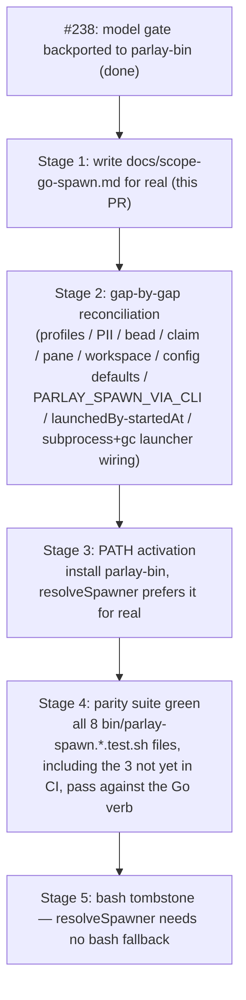

# Go spawn reconciliation scope

**Status:** binding scope doc for the `tools/parlay-bin` ↔ `bin/parlay-spawn` reconciliation
(task-04g1, [discussion #237](https://github.com/trillium/parlay/discussions/237)).
**Written:** 2026-09-03.
**Scope:** documentation and comment-fix only. This document's own PR changes no runtime
behavior anywhere — see [`AGENTS.md`](../AGENTS.md) / `CLAUDE.md` for the repo's
docs+comments-only convention.

This file did not exist before this PR. `tools/parlay-bin`'s own source comments have cited
it since PR #23 (2026-08-03) — `main.go`, `launcher.go`, `env.go`, `color.go`,
`identitycli.go`, `spawn.go`, `spawnpipeline.go`, `reset.go`, and their test files all point
at sections below. Those citations were aspirational until now: before this PR, `git log
--all --diff-filter=A -- docs/scope-go-spawn.md` returned nothing — the same pattern noted
elsewhere in `CLAUDE.md` for `docs/scope-go-server.md` and `docs/scope-go-cli.md`.

Every claim below was re-verified against the current tree (`bin/parlay-spawn` at 1859
lines, `tools/parlay-bin/spawn.go` at 366 lines, both post-rebase onto `origin/main`
including PR #238's mandatory-model gate and PR #236's idle-reap launch-record stamping) —
not carried over from an earlier report. Where verification disagreed with a prior summary
(PR #238's own body, in one place), §8 says so and cites the code that settles it.

---

## 1. `bin/parlay-spawn` today — the authoritative inventory

`bin/parlay-spawn` is **1859 lines** (`wc -l bin/parlay-spawn`), not the ~600 lines
discussion #237's original post described — it had already grown to 1464 lines by a
2026-08-25 comment on task-04g1, and 1854 by the time `tools/parlay-bin`'s dead-port note
was written (2026-09-03). Nothing in this section is inferred; every row cites the script.

### 1.1 Invocation shapes

| Shape | Positionals | Citation |
|---|---|---|
| Named | `<agent-id> <display-name> <hex-color> [<initial-prompt>]` (prompt optional with `--claim`) | `bin/parlay-spawn:1023-1035` |
| Ephemeral | `--ephemeral <initial-prompt>` (must be first arg) | `bin/parlay-spawn:618-619`, usage line 2 |
| Batch | `<id>=<repo> [<id>=<repo> ...] --prompt TEXT` | `bin/parlay-spawn:620`, batch loop ~900-1021 |
| Catalog | `--list` (prints `packages/spawn-profiles/profiles.toml` + live quota-axi headroom; spawns nothing) | `bin/parlay-spawn:621,627-630,817-820` |

### 1.2 Full flag reference

Verified against `usage()`, `bin/parlay-spawn:616-726`, and the named-path parse loop at
`bin/parlay-spawn:1049-1072`.

| Flag | Effect | Citation |
|---|---|---|
| `--cwd PATH` | working directory for the spawned claude (default `$HOME`) | `:644` |
| `--focus` | focus the new terminal (default `--no-focus`) | `:645` |
| `--model MODEL` | **required unless `--profile` names a model-bearing profile** — no implicit inheritance, no silent sonnet fallback (task-qyu8q) | `:646-653`, gate at `:553-614` (per the summarized offset range; the gate function is `require_model`) |
| `--profile NAME` | resolves a `packages/spawn-profiles/profiles.toml` entry (kind + model); satisfies the model requirement when the profile carries a model | `:654-657` |
| `--kind KIND` | agent harness launched via herdr (default `claude`); e.g. `opencode`, forwarding `--model` verbatim | `:658-663` |
| `--mode MODE` | `report` (default) \| `branch` \| `pr` — shapes the Definition of Done | `:664-668` |
| `--effort LEVEL` | forwarded to claude (`low\|medium\|high\|xhigh\|max`) | `:669-670` |
| `--worktree` | isolated git worktree at `<repo>/.worktrees/parlay-<id>`; auto-enabled by `--mode branch\|pr`; treehouse-first, plain-`git worktree add` fallback | `:671-674` |
| `--account NAME` | ccjuggler account; resolves `CLAUDE_CODE_OAUTH_TOKEN` from keychain or `~/.ccjuggler/NAME/.oauth-token` | `:675-678` |
| `--workspace ID\|LABEL` | lands the tab in a herdr workspace; label lookup creates one if absent; falls back to `$HERDR_WORKSPACE_ID` | `:679-682`, `resolve_workspace()` `:1138-1164` |
| `--pii` | blocks free/third-party model APIs, forces claude, labels the bead `contains-pii` | `:683-686` |
| `--no-pii` | routes to a free opencode model via a live `opencode models` check (never a hardcoded name — robots-pd98); ignored if the bead is already `contains-pii`-labeled | `:687-693` |
| `--bead ID` | binds a beads work item; **required** when beads-required mode is on | `:694-700` |
| `--force` | bypasses beads-required mode for this one spawn | `:701` |
| `--subprocess` (alias `--gascity`, deprecated) | herdr-free detached-subprocess launcher for this one spawn | `:702-707` |
| `--claim TASK-ID` | first turn is `parlay claim <task-id>`; makes the initial-prompt positional optional | `:637-640` |
| `--pane ID` | in-place mode: skip tab creation, launch into an existing herdr pane | `:1063`, `:1494-1496` |
| `--ephemeral` | mint a random `eph-XXXXXXXX` identity instead of id/name/color positionals; must be first arg | `:641-643` |

A third launcher, `PARLAY_SPAWN_LAUNCHER=gc` (env/config only, **no flag**), routes through
Gas City's session runtime via `parlay gc-spawn` — opt-in, claude-kind only (`:708-711`).

### 1.3 Environment variables

| Var | Effect | Citation |
|---|---|---|
| `PARLAY_SERVER` | base URL (default `http://localhost:4242`) | `:31,36` |
| `PARLAY_SPAWN_DEFAULT_ACCOUNT` | default `--account` value when not passed; empty string disables | `:32-34` |
| `PARLAY_SPAWN_NO_WATCHDOG` | `1` disables the post-launch liveness watchdog | `:35` |
| `PARLAY_SPAWN_LIVENESS_TIMEOUT_MS` | watchdog's "did the first turn fire" window (default 60000) | `:36` |
| `PARLAY_SPAWN_VIA_CLI` | **REQUIRED, must equal `1`.** `parlay spawn` is the sole public entry point and sets this before exec'ing this script; direct invocation hard-refuses, exit 2 | `:37-41`, enforced `:45-57` |
| `PARLAY_SPAWN_LAUNCHER` | `herdr` (default) \| `subprocess` \| `gc`; overridden per-call by `--subprocess`/`--gascity` | `:75-105` |
| `PARLAY_SPAWN_BEADS_REQUIRED` | `1`/`true`/`yes`/`on` turns on beads-required mode | `:107-133` |

### 1.4 `~/.parlay/config.toml` defaults (env var always wins)

Read via inline `python3 -c 'import tomllib'` heredocs; a missing `python3` silently falls
through to the built-in default (`:64,87,116`).

| Key | Governs | Citation |
|---|---|---|
| `spawnAccount` | default `--account`, settable with `parlay spawn-account set <name>` | `:60-73` |
| `[spawn] launcher` | default launcher (`herdr`/`subprocess`/`gc`) | `:85-103` |
| `[spawn] beads_required` | default beads-required mode | `:114-133` |

### 1.5 Exit codes

`2` — usage error, refused-without-model, refused-without-`PARLAY_SPAWN_VIA_CLI`, or a
beads-required refusal before any side effect. `1` — a failure after some side effect has
already happened (e.g. registration succeeded, herdr launch failed). `0` — success.

### 1.6 The three launchers

1. **herdr** (default) — creates a terminal tab via the `herdr` CLI, starts the agent in its
   root pane. Prefers herdr's RPC socket when the daemon is up, falls back to shelling the
   binary (`:202-334`, per the earlier full read of this script).
2. **subprocess** (`--subprocess`/`--gascity`) — herdr-free detached-process escape hatch for
   herdr's SIGKILL failure mode in headless/no-WindowServer environments. Backed by
   `bin/parlay-pii-lib.sh`-adjacent state files under `~/.parlay/agents/<id>/gascity/`
   (directory name kept for backward compatibility with sessions started before the
   gascity→subprocess rename — see `tools/parlay-bin/subprocess_spawn.go:34-39,96-104`).
3. **gc** (`PARLAY_SPAWN_LAUNCHER=gc`, env/config only) — opt-in Gas City session runtime via
   `parlay gc-spawn`; claude-kind only (`:1452-1483` per the earlier full read).

**Naming trap, stated once so it does not get relitigated:** "gascity" as a launcher name in
this codebase means two unrelated things depending on where you read it. In
`bin/parlay-spawn` and `tools/parlay-bin/subprocess_spawn.go`, `gascity`/`--gascity` is the
**deprecated pre-rename spelling of `subprocess`** — a from-scratch Go port of just the
lifecycle semantics (detached child, SIGTERM-then-SIGKILL), not an import of or wrapper
around the real `gc` binary (`subprocess_spawn.go:1-55`). The **actual** Gas City
integration is the third launcher, `gc`, which does shell out to the real `gc` CLI and is
documented in `docs/gascity-integration-contract.md`. Do not read a `gascity_spawn.go`
citation in that contract doc as evidence this file exists here — it does not
(`find tools/parlay-bin -iname 'gascity*'` returns only `subprocess_spawn.go`'s comment
trail, no such file).

---

## 2. Gap matrix — `tools/parlay-bin` vs. `bin/parlay-spawn`

`tools/parlay-bin` is its own Go module (`go.mod` module
`github.com/trillium/parlay/tools/parlay-bin`), built and tested in CI's `GO_MODULES` list,
originated PR #23 (2026-08-03). **It is not installed on any PATH in production.**
`tools/cli/internal/commands/launch.go:85` (`spawnerNames = []string{"parlay-bin",
"parlay-spawn"}`) prefers it by name via `exec.LookPath`, but since no host actually has a
`parlay-bin` binary on PATH, `resolveSpawner()` (`launch.go:99-111`) always falls through to
`bin/parlay-spawn` today — the Go path is dead code in practice, not evidence it is
exercised.

Legend: **Full** = behaviorally equivalent, verified against both sources. **Partial** =
implements the mechanism but not the full flag/config surface. **Missing** = no code path at
all. **Divergent** = implemented differently on purpose (noted as such) or by accident (flagged).

| Organ | bash | `parlay-bin` | Status | Citation |
|---|---|---|---|---|
| Named/ephemeral/batch dispatch shapes | ✓ | ✓ | **Full** | `spawn.go:153-161` (`runSpawnCommand`), `runNamedSpawn`/`runEphemeralSpawn`/`runBatchSpawn` |
| `--cwd`/`--focus`/`--model`/`--mode`/`--effort`/`--worktree`/`--account` | ✓ | ✓ | **Full** | `spawn.go:83-130` (`parseTailFlags`) |
| Mandatory `--model` refusal (task-qyu8q) | ✓ (`require_model`) | ✓ | **Full** — landed 2026-09-03 by PR #238, four weeks after the port's prior feature work; see §8 for the state before that PR | `spawn.go:138-155` (`requireModel`), called from all three shapes at `:197,222,323` |
| `PARLAY_SPAWN_VIA_CLI` handshake enforcement | ✓ hard refusal, exit 2 (`:45-57`) | ✗ | **Missing** | no match for `PARLAY_SPAWN_VIA_CLI` anywhere in `tools/parlay-bin/*.go` — confirmed by repo-wide grep. This is a one-front-door invariant gap; see §8 finding F1 |
| Kebab-slug agent-id validation | ✓ | ✓ | **Full** | `spawn.go:41-46` (`validateKebabSlug`) |
| Duplicate-agent guard | ✓ | ✓ | **Full** | `spawnpipeline.go:52-56` |
| Registration (`register-agent` POST) | ✓ | ✓ | **Partial — missing `launchedBy`/`startedAt`** | bash: `bin/parlay-spawn:1210-1213` sends `"launchedBy":"parlay-spawn"` + `startedAt`; `parlay-bin`: `httpclient.go:38-45` (`registerAgent`) sends only `id`/`name`/`color`. See §8 finding F2 — this may break task-4dz9's idle-reap classification for anything spawned through this binary, pending a read of `shouldIdleReap`'s actual predicate. |
| Hello reply (best-effort) | ✓ | ✓ | **Full** | `httpclient.go:47-54` |
| `.env` sourcing | ✓ (static parse, no shell exec) | ✓ | **Full**, deliberately bit-identical semantics including the silent-drop-on-bad-key gap | `env.go:16-50` (`sourceDotEnv`) |
| `.envrc` sourcing via direnv | ✓ | ✓ | **Full** | `env.go:74-103` (`sourceEnvrc`) |
| Worktree creation, treehouse-first + plain-git fallback | ✓ | ✓ | **Full** — including the robots-d04t repo-identity guard and the wrong-repo-worktree rejection | `worktree.go:98-180` (`setupWorktree`). **Correction to PR #238's own body**, which described this as "git-toplevel only" — that undersold it; the treehouse lease path, `guardTreehousePool`, and both post-condition checks are present and match bash's `:364-409` block clause for clause. |
| herdr tab creation + AgentStart + rollback-on-failure | ✓ | ✓ (deliberately reordered, see below) | **Full**, with one improvement | `launcher.go:76-88`, `spawnpipeline.go:47-56` — `newHerdrLauncher()` fails fast **before** any registration/hello/context-write side effect, unlike bash which calls herdr unconditionally at the actual launch step with no `command -v herdr` guard, so a missing herdr under `set -e` aborts bash *after* those side effects already ran |
| herdr RPC-socket fast path | ✓ (prefers RPC when the daemon socket exists) | ✗ (always shells to the `herdr` binary) | **Divergent (correctness-neutral, latency-only)** | `launcher.go:90-99` (`runHerdrJSON` always uses `exec.Command`); bash's RPC path is at `:202-334` per the full earlier read |
| `agent_pane_busy` retry loop | ✓ (up to 60 attempts, tunable) | ✗ | **Missing** | no retry loop found in `launcher.go`'s `AgentStart` or `spawnpipeline.go` |
| Identity registration (`identity --register`) | ✓ | ✓ | **Partial — missing bead/GC fields** | `identitycli.go:44-87` (`registerIdentityOptions`/`registerIdentity`) has no `BeadID`, `GCSession`, or `GCCity` fields; bash's call at `:594-603` (per earlier read) forwards those when set |
| Ephemeral minting (`identity --mint-ephemeral`) | ✓ | ✓ | **Full** | `identitycli.go:22-42` (`mintEphemeral`) |
| Startup-prompt composition (single-sourced template) | ✓ | ✓ | **Full** — same `launch-templates/default.txt`, byte-identical trailing-newline handling (robots-hrt2) | `prompt.go:10-86` |
| Pre-trust workdir (`~/.claude.json`) | ✓ (jq, best-effort) | ✓ (atomic write: temp+fsync+rename, stricter than bash) | **Full, with a hardening improvement** | `env.go` companion `pretrustWorkdir` — actually `prompt.go`'s neighbor; see the file read directly: pretrust lives in its own file and does atomic temp-write+`Sync`+`Close`-checked+rename, unlike bash's plain `jq` overwrite |
| ccjuggler account token resolution | ✓ | ✓ | **Full** — delegates to the same `juggle` Go package bash's own account resolution was ported to | `account.go:9-30` |
| Post-launch liveness watchdog | ✓ (3 variants, one per launcher) | ✓ (herdr-only) | **Partial** — consistent today only because `parlay-bin` has no subprocess/gc launcher branch in the spawn pipeline yet (see next row); once those are wired, their watchdog variants are still missing | `watchdog.go:14-69` (`armWatchdog`) hardcodes an `AgentWait`/`AgentSend` pair against the `Launcher` interface, which only `herdrLauncher` implements |
| `--subprocess`/`--gascity` launcher selection *inside the spawn pipeline* | ✓ (`LAUNCHER=subprocess` branch, `:1646-1708` per earlier read) | ✗ | **Missing** — `subprocess-spawn`/`-stop`/`-ping` exist as **separate top-level `parlay-bin` subcommands** (`subprocess_spawn.go`), fully implemented in isolation, but `spawn.go`'s `parseTailFlags` has no `--subprocess` case and `spawnpipeline.go`'s `launcherFactory` always constructs a `herdrLauncher` | `spawn.go:83-130` (no `--subprocess` case); `spawnpipeline.go:10` (`launcherFactory` hardcoded to `newHerdrLauncher`) |
| `gc` launcher selection | ✓ (`:1452-1483`) | ✗ | **Missing** | no `gc`/`PARLAY_SPAWN_LAUNCHER` handling anywhere in `tools/parlay-bin` |
| Color algorithm (`color_from_id`/FNV-1a) | ✓ | ✓ | **Full, bit-identical by contract** | `color.go:5-25` — explicitly documents the three-way parity obligation against `packages/cli/src/identity-ephemeral.ts` and bash's own `color_from_id()` |
| `--profile`/`--list` (profiles.toml + quota-axi headroom) | ✓ | ✗ | **Missing entirely** | no `profile`/`quota` reference anywhere in `tools/parlay-bin/*.go` |
| `--kind` (opencode etc.) | ✓ | ✗ | **Missing** | `SpawnOptions` (`spawn.go:57-70`) has no `Kind` field; `AgentStart` in `spawnpipeline.go:130-135` is hardcoded `Kind: "claude"` |
| `--pii`/`--no-pii` routing | ✓ (`bin/parlay-pii-lib.sh`) | ✗ | **Missing entirely** | no PII-related identifier anywhere in `tools/parlay-bin` |
| `--bead`/beads-required gating, `--force` | ✓ | ✗ | **Missing entirely** | `SpawnOptions` has no `BeadID`/`Force` field; no beads-required check anywhere |
| `--claim` | ✓ | ✗ | **Missing** | no `Claim` field, no `parlay claim` shell-out |
| `--pane` (in-place mode) | ✓ | ✗ | **Missing** | `TabCreateOptions`/`AgentStartOptions` have no way to skip tab creation and target an existing pane |
| `--workspace` resolution | ✓ (`resolve_workspace`, ID-or-label with auto-create) | ✗ | **Missing** | `TabCreateOptions.WorkspaceID` (`launcher.go:21`) is passed straight to `--workspace` with no label-lookup/auto-create logic; only `$HERDR_WORKSPACE_ID` passthrough exists (`spawnpipeline.go:124`) |
| `~/.parlay/config.toml` defaults (`spawnAccount`, `[spawn] launcher`, `[spawn] beads_required`) | ✓ | ✗ | **Missing entirely** | no TOML parsing anywhere in `tools/parlay-bin` |
| `PARLAY_SPAWN_DEFAULT_ACCOUNT` | ✓ | ✗ | **Missing** — `--account` itself works, but nothing resolves a default when it's absent | `defaultSpawnOptions()` (`spawn.go:72-77`) leaves `Account` empty with no env fallback |
| herdr tab/pane **creation** as a from-scratch Go capability | n/a (bash always had this) | ✓, but this was a from-scratch write, not a port | **Note, not a gap** | `commands/herdr.go` (in `tools/cli`, separate module) only covers teardown/close; `tools/parlay-bin/launcher.go` is the only Go code anywhere in the repo that creates herdr tabs/panes |

---

## 3. Launcher integration (herdr)

`Launcher` (`tools/parlay-bin/launcher.go:40-71`) is the seam every future launcher-parity
fix goes through: `AgentGet`, `TabCreate`, `AgentStart`, `TabClose`, `PaneClose`,
`AgentWait`, `AgentSend`, `TabsForLabel`. The one production implementation,
`herdrLauncher` (`:74-203`), shells to the `herdr` binary on PATH for every call — there is
no RPC-socket fast path (bash's `:202-334`-block preference for the daemon socket when
present is not ported). This is a **latency** divergence, not a correctness one: every
`herdr` subcommand `herdrLauncher` invokes has an equivalent RPC message in bash's own
wrapper functions, so reconciling this organ means adding an RPC-first code path behind the
same `Launcher` interface, not changing the interface's shape.

`newHerdrLauncher()` (`:83-88`) is called **before** `spawnOne` performs any side effect —
registration POST, hello reply, `context.json` write (`spawnpipeline.go:47-63`). This is a
deliberate improvement over bash, which calls `herdr` unconditionally at the actual launch
step with no `command -v herdr` guard (`bin/parlay-spawn` has no such check before its
launcher branches), so under `set -e` a host with no herdr on PATH aborts bash **after**
those side effects have already run, leaving an orphaned registration with no live process
behind it. Any reconciliation work must preserve this ordering — it is a strict improvement,
not a difference to "fix away."

---

## 4. Environment sourcing semantics

`sourceDotEnv` (`tools/parlay-bin/env.go:24-50`) and `sourceEnvrc` (`:80-103`) are a
deliberately **static, line-by-line parse with no shell execution, no value unquoting, no
inline-comment stripping, and no `${VAR}` expansion** — mirroring bash's own `.env` block
(`bin/parlay-spawn:507-519`) byte-for-byte, including its known gap: a line whose key fails
`^[A-Za-z_][A-Za-z0-9_]*$` is silently dropped with no warning either direction (`env.go:43-45`,
matching bash's bare `if` with no `else` at its line 513). Do not "fix" this drop during
reconciliation without also changing bash — the contract is parity, and this specific
behavior has never been reported as a defect in either implementation. `.envrc` sourcing
only runs `direnv exec <cwd> env` when both `direnv` is on PATH and `<cwd>/.envrc` exists,
against a clean two-var baseline env (`HOME`/`PATH`) so the diff is (approximately) just what
the project's `.envrc` added — never a blanket forward of the caller's ambient env
(`env.go:80-103`).

---

## 5. Cross-implementation hazards — the risk register

These are the places where the Go port's own comments already flag a specific way this
package could silently drift from bash or from its sibling implementations. Anyone doing
reconciliation work should re-check this list before landing an organ, not just the gap
matrix in §2.

1. **The shell-escaping boundary is sidestepped, not solved, for the launch command.**
   `spawnpipeline.go`'s `launchScript` (`:24`) is a **fixed string**, not templated per
   spawn — `$PARLAY_SPAWN_MODEL` and `$PARLAY_SPAWN_PROMPT` are read from the *launched
   process's own environment* (set via `herdr tab create --env`) when the script actually
   runs, never interpolated into a shell command string by this Go program. This means the
   prompt text — arbitrarily large, arbitrary characters — never crosses a Go→shell string-
   building boundary at all. Any reconciliation work that starts templating flags into
   `launchScript` (e.g. to support `--kind`) reintroduces exactly the class of bug this
   design avoided; prefer extending the env-var contract instead.
2. **The color algorithm has three independent implementations that must stay bit-identical**
   with no shared source: `tools/parlay-bin/color.go`, `packages/cli/src/identity-ephemeral.ts`
   (JS, `Math.imul` + `>>> 0`), and bash's own `color_from_id()` (`&
   0xffffffff` masking). A drift in any one silently changes tab colors for batch-spawned or
   ephemeral agents with no error — there is no cross-implementation test that would catch
   it today beyond `color_test.go`'s fixed-vector assertions against the Go implementation
   alone.
3. **This binary depends on `parlay` (the Bun CLI) being on PATH regardless of Go-native
   status.** `identitycli.go`'s `mintEphemeral`/`registerIdentity` both shell to `parlay
   identity ...` rather than reimplementing identity management — a deliberate scope
   boundary (identity stays out of this port), but it means "retire the bash spawner" does
   not mean "remove the Bun runtime dependency."
4. **Process detachment correctness is load-bearing and easy to get subtly wrong.**
   `subprocess_spawn.go`'s detached child (`Setpgid: true`, stdio to `/dev/null`, no `Wait`
   on the main path) and `reset.go`'s `spawnDetachedWatcher` (`Setsid: true`, closed
   inherited stdio) both exist specifically so a child survives its parent CLI process's
   exit. Any refactor of either must re-verify the child still detaches — a regression here
   fails silently (the child dies with the parent, or the parent blocks on a pipe) with no
   test short of an actual process-tree inspection.
5. **The test harness is a PATH-stubbed `herdr` shim, not a mock at the Go level**, for
   integration-style tests (`spawn_test.go`); unit tests instead substitute
   `launcherFactory` (`spawnpipeline.go:10`) with an in-process mock. Reconciliation work
   that changes `Launcher`'s shape must update both test styles, not just one — a shim-only
   check can pass while an in-process mock in a different test file still encodes the old
   interface.
6. **`bin/parlay-spawn.*.test.sh` is the parity oracle, and it is already incomplete
   independent of this port.** Of 8 files
   (`bin/parlay-spawn.{account,batch,integration,list,model-required,quoting,templates,worktree}.test.sh`),
   only 5 run in CI (`.github/workflows/ci.yml:421-425`: templates, integration, quoting,
   batch, worktree). `.account.test.sh`, `.list.test.sh`, and `.model-required.test.sh` exist
   on disk but are not wired into any CI job — flagged in PR #238's body as a pre-existing
   gap, not introduced by this doc. §7's "parity green" gate should wire all 8 in, not just
   the 5 already running, or the gate is checking less than it claims to.

---

## 6. One-front-door invariants — must survive every stage

These three properties are the contract every stage of reconciliation is checked against.
None of them may regress at any intermediate state, even a "coherent green milestone" per
task-04g1's escape hatch.

1. **`PARLAY_SPAWN_VIA_CLI` handshake.** `parlay spawn` (`tools/cli/internal/commands/spawn.go:24-47`)
   is the sole public entry point; it sets `PARLAY_SPAWN_VIA_CLI=1` in the child's env
   (`:40`) before exec'ing whichever spawner `resolveSpawner()` picked. `bin/parlay-spawn`
   hard-refuses without it (`:45-57`, exit 2). **`tools/parlay-bin` does not enforce this at
   all today** — see §8 finding F1. Whatever organ reconciliation adds this check must land
   before `parlay-bin` is ever installed on PATH (§7 stage 3), or a direct
   `parlay-bin spawn ...` invocation becomes a second, unguarded front door the moment the
   binary exists anywhere reachable.
2. **Mandatory `--model` refusal (task-qyu8q).** No spawn may proceed without a deliberately
   chosen model — bash's `require_model` (`:553-614` per the full read) and Go's
   `requireModel` (`spawn.go:138-155`, landed by PR #238) both refuse with exit 2 rather than
   inheriting the launching session's model or silently defaulting to sonnet. Confirmed
   present in both implementations as of this doc.
3. **#236 lifecycle launch records (`launchedBy`/`startedAt`).** task-4dz9 (PR #236,
   2026-09-03) extended the agent registry row with `launchedBy`/`startedAt`
   (`packages/server/src/types.ts`), stamped at `/api/chat/register-agent` time so
   `idle-reap` (`packages/server/src/prune/idle-reap.ts`) can distinguish Parlay-spawned
   agents (subject to idle reaping) from firstmate-spawned ones (which never set
   `launchedBy` and are therefore out of the reaper's reach by construction — firstmate has
   its own lifecycle tracking). `bin/parlay-spawn` stamps `"launchedBy":"parlay-spawn"` on
   every registration (`:1210-1213`). **`tools/parlay-bin`'s `registerAgent` does not send
   either field** — see §8 finding F2. This is at minimum a missed piece of intended
   bookkeeping, and plausibly a silent idle-reap misclassification: an agent spawned through
   `parlay-bin` today would register with no `launchedBy`, and `idle-reap`'s predicate must
   be checked against what it actually does with a missing field — reap, exempt, or error —
   before this organ can be called reconciled. That read has not been done in this pass; see
   §8.

---

## 7. Staged reconciliation plan

Per discussion #237's 2026-09-03 correction comment, the road ahead is a reconciliation
against the existing partial port, not a fresh one-PR port. Five stages; each stage's
"done" gate is checked before starting the next.

**Stage 1 — this PR.** Write this document; fix `tools/parlay-bin`'s dangling citations to
point here. No behavior change.

**Stage 2 — gap-by-gap reconciliation.** Close every row marked Missing or Partial in §2, in
whatever order minimizes risk per organ (a natural order: the two one-front-door gaps first —
`PARLAY_SPAWN_VIA_CLI` enforcement and `launchedBy`/`startedAt` stamping — since those are
correctness-critical and small; then config.toml defaults, since several flag-resolution
gaps depend on it; then the flag surface itself: `--profile`/`--list`, `--pii`/`--no-pii`,
`--bead`/`--force`, `--claim`, `--pane`, `--workspace`; then wiring the already-implemented
`subprocess`/`gc` launchers into the spawn pipeline's launcher selection). **Done** when
every §2 row reads Full, or a Divergent row's divergence is a deliberate, documented
improvement (like the herdr-availability-ordering fix in §3) rather than an unnoticed gap.
Each landed organ is its own PR against `tools/parlay-bin`; `bin/parlay-spawn` is untouched
throughout — it remains the only spawner anything depends on until Stage 3.

**Stage 3 — PATH activation.** Install `parlay-bin` on a real PATH (CI first, then hosts) so
`resolveSpawner()`'s existing preference for it (`launch.go:99-111`) takes effect for real
instead of always falling through. **Done** when `which parlay-bin` resolves in CI and on the
captain's box, and `parlay spawn ...` demonstrably launches through the Go verb, not bash —
verified, not assumed, the same way this doc verified the treehouse-worktree claim in §2
rather than trusting a prior summary.

**Stage 4 — parity suite green.** Point all 8 `bin/parlay-spawn.*.test.sh` files at the Go
verb (not just the 5 currently wired into CI — wire the remaining 3 in as part of this
stage, per §5 item 6) and get them green. This suite tests the CLI surface behaviorally, not
the implementation, so it is the actual acceptance gate for "the two implementations behave
the same," independent of the gap matrix's organ-by-organ bookkeeping. **Done** when all 8
pass against `parlay-bin` in CI.

**Stage 5 — bash tombstone.** Replace `bin/parlay-spawn`'s body with a two-line hard-error
pointing at `parlay spawn`, consistent with the one-front-door decision's existing
hard-error style (the same pattern `PARLAY_SPAWN_VIA_CLI`'s own refusal already uses). Note
this is orthogonal to `docs/go-cli-parity.md`'s "Go-only verbs" table, which already lists
`spawn` (line ~65) — that entry is about the `parlay spawn` **CLI verb** having no TS
counterpart to port, a question the retired TS↔Go parity harness (`GO_ONLY_VERBS`,
`tools/cli/parity/run.sh`, deleted with `packages/cli` in T-08 per `AGENTS.md`) already
settled and which this reconciliation does not reopen. What Stage 5 actually retires is the
**implementation** `parlay spawn` execs — bash today, Go-native after this stage — so its
only artifact to update is `resolveSpawner()`'s own behavior (or removal, once `bin/
parlay-spawn` is a pure tombstone `resolveSpawner` never needs to fall back to). **Done**
when `bin/parlay-spawn` is the tombstone and no code path anywhere still execs the old bash
body.

Each stage ships a coherent, independently green state — per task-04g1's own escape hatch
("if the port turns out to be too large to land safely in one task, stop at a coherent green
milestone"). Nothing later in this plan is blocked on doing all of it in one sitting.

---

## 8. Verification findings (not fixed in this PR)

This PR is documentation and comment-fix only. The following were surfaced while verifying
every claim above against current code; they are findings for a future reconciliation PR to
act on, not something fixed here.

**F1 — `tools/parlay-bin` never checks `PARLAY_SPAWN_VIA_CLI`.** Confirmed by grepping every
`.go` file in `tools/parlay-bin` for the literal string — zero matches outside this doc's own
description of the bash behavior. Today this is inert only because nothing installs
`parlay-bin` on PATH (§2's opening paragraph); the moment Stage 3 (§7) makes it reachable,
this becomes a real second front door unless closed first. Recommend closing this as the
first item of Stage 2, before any other gap-matrix row, since every other gap is a missing
*feature* while this one is a missing *guard*.

**F2 — `tools/parlay-bin`'s `registerAgent` does not stamp `launchedBy`/`startedAt`.**
Confirmed: `httpclient.go:38-45` posts only `id`/`name`/`color` to `/api/chat/register-agent`,
where bash's equivalent call (`bin/parlay-spawn:1210-1213`) also sends
`"launchedBy":"parlay-spawn"` and a `startedAt` timestamp. Per §6 invariant 3, this means an
agent spawned through the (currently dead-on-PATH) Go verb would register with a missing
`launchedBy`, and `idle-reap`'s classification of such an agent has not been independently
checked against `shouldIdleReap`'s actual predicate (`packages/server/src/prune/idle-reap.ts`)
in this pass — that predicate's handling of a missing `launchedBy` should be read before
deciding whether this is merely "misses the intended new-lifecycle bookkeeping" or "actively
misclassifies as firstmate-owned and never reaps." Recommend checking that predicate and
closing this alongside F1.

**Correction to PR #238's own body (not a `parlay-bin` defect):** PR #238 described
`tools/parlay-bin`'s worktree support as "git-toplevel only." Direct re-verification of
`worktree.go:98-180` in this pass shows the treehouse-lease path, `guardTreehousePool`
(robots-n8d9), and both post-condition identity checks are present and match
`bin/parlay-spawn`'s worktree block clause for clause — this row is **Full** in §2, not
Partial. Noted per the honest-docs rule: where a verified claim disagrees with a prior
report, say which one is authoritative and why. This document's §2 row is the corrected
claim, re-derived from the code rather than carried over from PR #238's summary.
